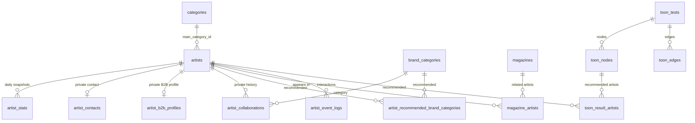

# INTOONI 내부 데이터베이스 인수인계서

작성일: 2026-07-23
대상: Supabase PostgreSQL `public` 스키마, 관리자 API, Google Sheets 연동, 공개 데이터 전달 경로

## 1. 먼저 알아둘 운영 원칙

이 서비스의 원본 데이터는 Supabase DB이며, Google Sheets는 운영자가 일괄 편집·검수할 때 사용하는 동기화 채널이다. 공개 웹은 DB 테이블을 브라우저에서 직접 읽지 않는다. 서버가 공개용 DTO로 변환해 필요한 필드만 전달한다.

| 구분 | 원칙 |
| --- | --- |
| 작가 삭제 | 물리 삭제 대신 `artists.status = 'archived'`와 공개 해제를 사용한다. |
| 인스타 ID | `@` 제거·공백 제거·소문자화 후 전 상태(활성/숨김/보관)에서 고유해야 한다. |
| 공개 작가 | `status = 'active'` 이면서 `show_on_site = true`인 작가만 공개한다. |
| 통계 | `artists`에 누적값을 두지 않고 `artist_stats`에 날짜별 스냅샷으로 저장한다. |
| 비공개 정보 | 연락처, 내부 메모, B2B 평가, 협업 이력은 공개 DTO에 절대 포함하지 않는다. |
| 운영 권한 | 브라우저에는 anon key만 두고, 쓰기·내부 조회는 서버의 service-role 클라이언트와 관리자 세션을 통해서만 수행한다. |

> 주의: 이 문서는 저장소의 목표 스키마(`supabase/schema.sql`)와 현재 코드 기준이다. 원격 Supabase에 모든 마이그레이션이 이미 적용됐다고 가정하면 안 된다. 인수인계 직후 아래의 “원격 DB 확인”을 먼저 수행한다.

## 2. 전체 구조



도메인별 책임은 다음과 같다.

| 도메인 | 테이블 | 용도 |
| --- | --- | --- |
| CORE | `categories`, `artists`, `artist_stats` | 작가 공개 정보와 일자별 인스타 통계 |
| BUSINESS | `artist_contacts`, `brand_categories`, `artist_recommended_brand_categories`, `artist_b2b_profiles`, `artist_collaborations` | 내부 영업·협업 데이터 |
| EDITORIAL | `magazines`, `magazine_artists` | 매거진과 관련 작가 순서 |
| TOONBTI | `toon_tests`, `toon_nodes`, `toon_edges`, `toon_result_artists` | 분기형 작가 추천 테스트 |
| ANALYTICS | `artist_event_logs`, `search_query_logs` | 클릭·검색 원시 로그 |
| OPS | `sheet_sync_jobs`, `migration_legacy_backup` | Sheets 작업 감사·레거시 복구 근거 |

## 3. 테이블별 인수인계

### 3.1 작가와 분류 — CORE

| 테이블 | 핵심 키/제약 | 주요 필드 | 운영 메모 |
| --- | --- | --- | --- |
| `categories` | `id` PK, NFC 정규화된 `name` 고유 | `name`, `sort_order`, timestamps | 작가의 대표 카테고리. 삭제 전 연결 작가를 반드시 확인한다. |
| `artists` | `id` PK, `main_category_id → categories`, 정규화된 `instagram_handle` 고유 | 이름, 소개, 공개/검색 태그, 썸네일·캐릭터·갤러리 URL, 노출 설정, 상태, 내부 메모 | 서비스의 작가 원장. 일반 삭제 금지. |
| `artist_stats` | `(artist_id, recorded_date)` 고유 | `followers`, `post_count`, `recorded_date` | 하루 한 행. 동일 작가·날짜는 update/upsert한다. |

`artists` 상태와 공개는 별개의 의미다.

| 값 | 의미 | 공개 노출 |
| --- | --- | --- |
| `status = 'active'`, `show_on_site = true` | 정상 공개 작가 | 노출 |
| `status = 'hidden'` 또는 `show_on_site = false` | DB에는 보존하되 공개 비노출 | 미노출 |
| `status = 'archived'` | 운영 종료·보관 | 미노출 |

작가 등록 시 인스타그램 ID는 활성·숨김·보관 상태 모두와 비교한다. 관리자 화면은 중복 ID를 즉시 경고하고 저장을 막으며, 과거 중복 데이터가 있다면 목록 최상단에 경고 배지로 표시한다. DB에서도 `artists_instagram_handle_unique_idx`가 마지막 방어선이다.

작가의 주요 필드는 다음과 같다.

- 공개 후보: `name`, `instagram_handle`, `main_category_id`, `bio`, `hashtags`, `search_tags`, `mood_tags`, `style_tags`, `topic_tags`, `thumbnail_url`, `character_url`, `gallery_post_urls`, `is_trending`, `hide_from_new`, `sort_order`
- 운영 제어: `status`, `show_on_site`, `show_growth_on_site`, `internal_memo`
- 금지: `internal_memo`, 상태·공개 플래그를 공개 API/HTML/SEO payload에 넣지 않는다.

### 3.2 내부 영업·협업 — BUSINESS

| 테이블 | 관계 | 운영 규칙 |
| --- | --- | --- |
| `artist_contacts` | 작가당 최대 1행 (`artist_id` PK) | `email`, `dm_available`은 내부 전용. 빈 연락처를 억지로 만들 필요는 없다. |
| `brand_categories` | 브랜드 업종 카탈로그 | 작가 카테고리와 다르다. 예: 작가가 “일상툰”, 브랜드는 “뷰티”. |
| `artist_recommended_brand_categories` | 작가↔브랜드 카테고리 N:M | B2B 추천 업종. `(artist_id, brand_category_id)`가 PK. |
| `artist_b2b_profiles` | 작가당 최대 1행 | `strengths`, `cautions`, `brand_safety_grade` (`unknown/safe/normal/caution`). |
| `artist_collaborations` | 작가당 여러 행 | 브랜드명, 업종, 연·월, 인스타 게시물 URL, 내부 요약, 광고표기, 좋아요·댓글·조회수. |

협업 이력의 `post_url`은 작가별로 중복될 수 없으며, 연도는 2000 이상, 월은 1~12, 성과 수치는 음수가 될 수 없다. B2B 프로필과 추천 브랜드 카테고리는 `admin_replace_artist_b2b_profile(...)` 함수로 함께 교체해 트랜잭션 일관성을 지킨다. 이 함수는 service role만 실행 가능하다.

### 3.3 매거진 — EDITORIAL

| 테이블 | 핵심 내용 | 운영 규칙 |
| --- | --- | --- |
| `magazines` | 제목, 태그, 본문, 썸네일, 인스타 URL 배열, 조회수, 공개 여부, 발행일 | 공개 읽기는 `is_public = true`만 가능하다. |
| `magazine_artists` | `magazine_id`, `artist_id`, `sort_order` | 매거진 내 관련 작가와 표시 순서를 관리한다. |

관련 작가의 단일 기준은 `magazine_artists`이다. 오래된 운영 DB에는 `magazines.related_artist_ids` 배열이 남아 있을 수 있으나 레거시 호환용이며, 새 로직의 기준으로 사용하면 안 된다.

### 3.4 툰BTI — TOONBTI

| 테이블 | 역할 | 중요한 사실 |
| --- | --- | --- |
| `toon_tests` | 테스트 식별자, 발행 상태, 버전, 원자적 편집 초안 JSON | `draft`가 관리자 편집의 기준 데이터다. 현재 앱은 slug `default` 1개를 사용한다. |
| `toon_nodes` | 질문·결과 노드 정규화 사본 | `(test_id, node_key)` PK. |
| `toon_edges` | 선택지별 다음 노드 연결 | 질문 노드에서만 출발 가능. |
| `toon_result_artists` | 결과별 추천 작가 순서 | 추천 작가는 공개 가능한 활성 작가여야 한다. |

관리자에서 초안 저장/발행을 하면 `draft`를 먼저 저장하고, 노드·엣지·추천 작가 테이블을 삭제 후 다시 삽입해 동기화한다. 발행 검증은 시작 질문, 모든 질문의 선택지, 도달 가능한 결과, 모든 결과의 추천 작가, 순환 없음, 도달 불가 노드 없음을 확인한다.

공개 테스트는 점수 합산형이 아니라 선택지 연결을 따라가는 분기형이다. 복수 선택 질문은 현재 마지막으로 선택한 항목의 다음 노드를 따른다. 선택지의 태그·톤·스타일 보조 필드는 편집 데이터에는 남지만 공개 추천 계산에는 사용되지 않는다.

### 3.5 분석과 운영 로그 — ANALYTICS / OPS

| 테이블 | 기록되는 것 | 주의점 |
| --- | --- | --- |
| `artist_event_logs` | 작가 카드 클릭, 인스타 이동 등 | append-only 원시 로그. 현재 집계 표준은 `artist_click`, `instagram_outbound` 두 종류다. 과거 타입은 조회 시 정규화한다. |
| `search_query_logs` | 공개 검색어 | 검색어를 소문자·공백 정리 후 기록한다. 개인정보를 넣지 않는다. |
| `sheet_sync_jobs` | Sheets export/preview/apply 작업 | 작업 상태, 대상 시트, 요약, 오류를 감사용으로 저장한다. |
| `migration_legacy_backup` | 레거시 제거 전 JSON 백업 | 앱의 운영 원본이 아니다. 복구 증거로 보관한다. |

## 4. 접근 제어와 비밀값

### 권한 모델

- 모든 핵심 테이블은 RLS가 활성화되어 있다.
- `artists`, 통계, 연락처, B2B, 협업, 툰BTI, Sheets 로그는 `anon`/`authenticated`에 직접 권한을 주지 않는다.
- `categories`는 공개 select가 가능하다. `magazines`는 공개 읽기 정책이 있어도 `is_public = true`만 읽힌다.
- 서버의 `getSupabaseAdminClient()`가 service role로 내부 작업을 수행한다. service role key를 클라이언트·커밋·Sheets에 노출하지 않는다.
- 관리자 API는 서명된 `instoon-admin-session` 쿠키를 검사한다. 세션은 12시간이며 로그인 시도는 IP당 10분/10회 메모리 제한이다.

필수 환경 변수는 다음과 같다. 실제 값은 이 문서나 저장소에 기록하지 않는다.

```text
NEXT_PUBLIC_SUPABASE_URL=
NEXT_PUBLIC_SUPABASE_ANON_KEY=
SUPABASE_SERVICE_ROLE_KEY=
ADMIN_PASSWORD=
ADMIN_SESSION_SECRET=
```

### 공개 데이터 경계

공개 페이지와 `/api/public/artists`는 서버의 `PublicArtistDTO`만 사용한다. 공개 금지 항목은 최소한 아래와 같다.

- `email`, `dm_available`, `internal_memo`
- B2B 강점·주의사항·안전등급·추천 브랜드 카테고리
- 협업 이력과 브랜드명
- `status`, `show_on_site`, `show_growth_on_site`
- Sheets 작업 로그와 레거시 백업

새 공개 API를 만들 때는 원본 row를 그대로 반환하지 말고 `lib/domain/public-artist.ts`의 DTO 규칙을 재사용한다.

## 5. 일상 운영 절차

### 작가 신규 등록·수정

1. 관리자 작가 관리에서 이름, 인스타 ID, 대표 카테고리를 입력한다.
2. 중복 인스타 ID 경고가 없는지 확인한다. 숨김·보관 작가도 중복 대상이다.
3. 공개 노출 전 프로필, 검색 태그, 캐릭터 PNG, 갤러리 게시물, 상태를 검수한다.
4. 공개할 작가는 `active + show_on_site`를 확인한다.
5. 삭제 요청은 보관 처리로 전환한다. 관계·통계가 있는 작가를 DB에서 직접 삭제하지 않는다.

### 통계 수집·보정

1. Collector/Sheets에서 작가별 `recorded_date`, 팔로워, 게시물 수를 확인한다.
2. 같은 작가·같은 날짜의 값은 `artist_stats`에서 갱신한다.
3. 성장률은 저장하지 않고 현재/이전 스냅샷의 차이로 계산한다.
4. 성장 공개를 끄면 수치는 내부에는 남아도 공개 DTO의 증가값은 `null`이어야 한다.

### Google Sheets 동기화

1. 먼저 Export로 최신 DB 값을 Sheets에 반영한다.
2. 편집 후 Preview를 실행해 `CREATE`, `UPDATE`, `NO_CHANGE`, `CONFLICT`, `ERROR`를 확인한다.
3. 오류·충돌이 0건일 때만 Apply를 실행한다.
4. Apply 결과와 실패 원인은 `sheet_sync_jobs`에서 추적한다.

Sheets는 DB의 대체 저장소가 아니다. 특히 작가 ID, 날짜별 통계의 고유성, 협업 게시물 URL 중복은 Sheets 입력만으로 보장되지 않으므로 Preview를 생략하지 않는다.

### 툰BTI 발행

1. 관리자에서 질문·선택지·결과·추천 작가를 구성한다.
2. 결과별 추천 작가는 활성·공개 작가만 연결한다.
3. 관리자 내부 테스트로 모든 분기를 끝까지 통과시킨다.
4. 초안 저장 후 발행한다.
5. `/toonbti`에서 공개 테스트와 결과 작가 링크를 확인한다.

## 6. 원격 DB 확인 SQL

아래 쿼리는 읽기 전용 점검용이다. Supabase SQL Editor에서 실행한다.

```sql
-- 목표 테이블 존재 여부
select table_name
from information_schema.tables
where table_schema = 'public'
  and table_name in (
    'categories', 'artists', 'artist_stats', 'artist_contacts',
    'brand_categories', 'artist_recommended_brand_categories',
    'artist_b2b_profiles', 'artist_collaborations', 'magazines',
    'magazine_artists', 'artist_event_logs', 'search_query_logs',
    'toon_tests', 'toon_nodes', 'toon_edges', 'toon_result_artists',
    'sheet_sync_jobs', 'migration_legacy_backup'
  )
order by table_name;

-- RLS 활성화 여부
select relname as table_name, relrowsecurity as rls_enabled
from pg_class
where relnamespace = 'public'::regnamespace
  and relname in ('artists', 'artist_stats', 'artist_contacts', 'toon_tests', 'sheet_sync_jobs');

-- 인스타 ID 중복(정규화 기준)
select lower(trim(leading '@' from btrim(instagram_handle))) as handle,
       count(*) as count,
       array_agg(name order by created_at) as artists
from public.artists
group by 1
having count(*) > 1;

-- 공개 작가인데 대표 카테고리가 없는 데이터
select id, name, instagram_handle
from public.artists
where status = 'active'
  and show_on_site = true
  and main_category_id is null;

-- 통계가 없는 활성 작가
select a.id, a.name, a.instagram_handle
from public.artists a
left join public.artist_stats s on s.artist_id = a.id
where a.status = 'active'
group by a.id, a.name, a.instagram_handle
having count(s.id) = 0;

-- 현재 툰BTI 공개본 상태
select slug, title, status, version, updated_at
from public.toon_tests
order by updated_at desc;
```

## 7. 마이그레이션·복구 주의사항

마이그레이션은 `supabase/migrations/`의 번호 순서대로 관리한다. `000`은 레거시 기준선, `001~005`는 확장/보안/툰BTI 구조, `006`은 검증 후 레거시를 제거하는 파괴적 정리다.

다음 레거시 필드·테이블이 원격 DB에 남아 있을 수 있다.

- `artists.genre`, `hidden_tags`, `is_hot`
- 작가 행에 붙어 있던 팔로워·게시물·성장 관련 필드
- `magazines.related_artist_ids`
- `toonbti_question_groups`, `toonbti_question_options`, `artist_toonbti_option_links`

이 항목은 새 코드의 기준이 아니다. 특히 `202607110006_verified_legacy_cleanup.sql`은 백업·통계·매거진·툰BTI 발행 조건을 검사한 뒤 제거하는 파괴적 마이그레이션이므로, 원격 백업과 스테이징 검증 없이 실행하지 않는다. 복구 근거는 `migration_legacy_backup`에 남도록 설계되어 있다.

## 8. 장애 대응 체크리스트

| 증상 | 우선 확인 | 조치 |
| --- | --- | --- |
| 관리자 저장이 401 | `ADMIN_SESSION_SECRET`, 로그인 세션 | 재로그인 후 배포 환경 변수 확인 |
| 관리자 저장이 500/스키마 오류 | 원격 migration 적용 상태 | 누락된 additive migration을 스테이징에서 검증 후 적용 |
| 공개 작가가 안 보임 | `status`, `show_on_site`, category/DTO 필터 | 활성·공개 상태로 수정하고 캐시 재검증 |
| 인스타 ID 저장 실패 | 정규화된 중복, DB unique index | 숨김·보관 작가 포함 중복을 찾아 기존 행을 수정/병합 |
| 성장률이 비어 있음 | `artist_stats`의 최신·이전 스냅샷 | 최소 2개 날짜 스냅샷과 `show_growth_on_site` 확인 |
| Sheets Apply 거부 | Preview의 오류·충돌 | DB 최신값을 Export 후 충돌 행을 정리하고 재검토 |
| 툰BTI에 개선중 화면 | `toon_tests`의 published 행 | 관리자에서 유효한 루트맵을 발행하고 추천 작가 공개 상태 점검 |

## 9. 새 담당자가 첫날 수행할 일

1. Supabase 프로젝트 접근권한, Vercel 환경 변수, 관리자 비밀번호·세션 secret의 전달 경로를 확인한다.
2. 6절의 읽기 전용 SQL을 실행해 실제 원격 스키마와 데이터 품질을 확인한다.
3. 관리자에서 작가 1명, 협업 1건, Sheets Preview, 툰BTI 초안 조회를 각각 점검한다.
4. 공개 사이트에서 작가 목록·상세·매거진·검색·`/toonbti`를 점검한다.
5. destructive cleanup migration과 DB 직접 삭제 권한은 검증이 끝날 때까지 사용하지 않는다.

## 관련 소스

- 목표 스키마: `supabase/schema.sql`
- 마이그레이션: `supabase/migrations/`
- 공개 작가 변환: `lib/domain/public-artist.ts`, `lib/server/public-artists.ts`
- Supabase 클라이언트: `lib/supabase.ts`
- 관리자 인증: `lib/admin-auth.ts`
- Sheets 동기화: `lib/server/admin-sheets.ts`
- 툰BTI 저장/발행: `lib/server/toon-tests.ts`, `lib/domain/toon-test.ts`
