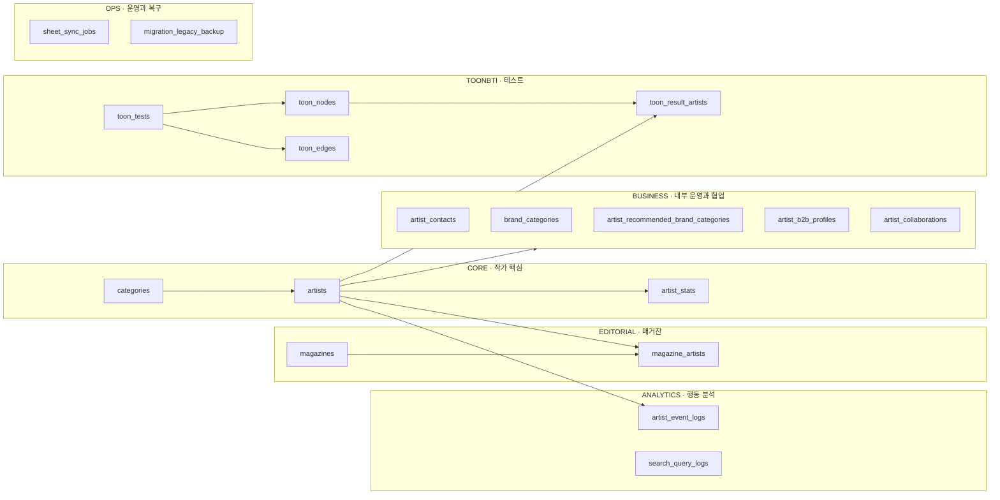
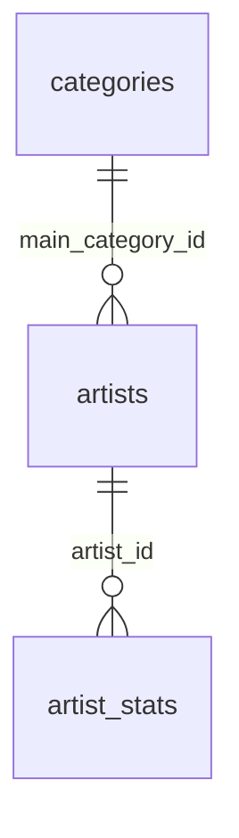
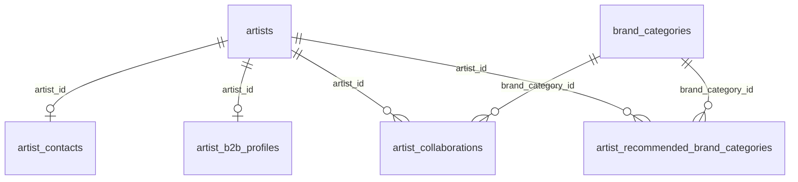
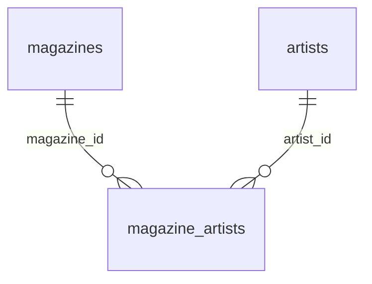
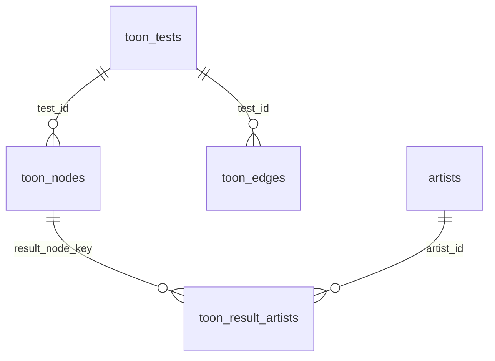
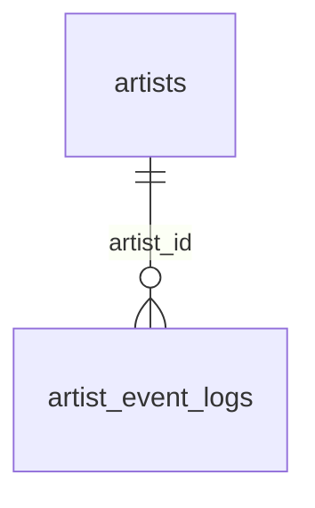

# 인투니 DB 권장 분류 지도

인투니 운영 DB의 테이블은 물리적으로 `public` 스키마에 유지하되, 업무 책임에 따라 여섯 영역으로 분류한다. 테이블 이동이나 이름 변경 없이 PostgreSQL 테이블 설명에 영역 접두어를 저장한다.

| 접두어 | 영역 | 테이블 수 | 책임 |
|---|---|---:|---|
| `CORE` | 작가 핵심 | 3 | 작가, 카테고리, 날짜별 통계 |
| `BUSINESS` | 내부 운영·협업 | 5 | 연락처, 브랜드, 협업, B2B 분석 |
| `EDITORIAL` | 매거진 | 2 | 글과 관련 작가 연결 |
| `TOONBTI` | 테스트 | 4 | 테스트, 노드, 경로, 추천 작가 |
| `ANALYTICS` | 행동 분석 | 2 | 클릭과 검색 로그 |
| `OPS` | 운영·복구 | 2 | Sheets 작업 감사와 이전 구조 백업 |

## 전체 지도

## CORE

- `categories`: 공개 작가 카테고리
- `artists`: 작가 프로필과 노출 설정의 공식 원본
- `artist_stats`: 작가별 날짜 통계 스냅샷

## BUSINESS

- 공개 웹사이트와 분리해야 하는 내부 데이터다.
- 작가 삭제보다 `artists.status='archived'`를 우선한다.
- 연락처와 B2B 프로필은 작가당 최대 한 행이고, 협업은 여러 행이다.

## EDITORIAL

- `magazines`: 매거진 글 자체
- `magazine_artists`: 글 안에서 임베드할 작가와 표시 순서

## TOONBTI

질문지 편집 도메인이다. 작가 관리와 별도 기능으로 이해한다.

## ANALYTICS

- `artist_event_logs`: 작가·Instagram 이동 이벤트
- `search_query_logs`: 검색어 이벤트

원시 로그가 매우 커진 뒤에만 집계 테이블, 보관 정책, 날짜 파티셔닝을 검토한다.

## OPS

- `sheet_sync_jobs`: Sheets Export/Preview/Apply 감사 로그
- `migration_legacy_backup`: 이전 DB 구조의 복구 증거

두 테이블은 업무 데이터가 아니므로 일반 작가 기능에서 읽지 않는다.

## 왜 테이블을 실제로 다른 스키마로 옮기지 않는가

`public.artists`를 `core.artists`처럼 물리적으로 이동하면 Supabase PostgREST 설정, 모든 `.from()` 호출, RLS, 함수, Collector를 함께 변경해야 한다. 분류 목적에 비해 장애 위험이 크다.

현재 단계의 정돈 원칙:

1. 실제 테이블과 관계는 유지한다.
2. 테이블 설명에 영역 접두어를 기록한다.
3. 문서에서는 영역별 ERD를 사용한다.
4. 기능이 커져 독립 배포가 필요해질 때만 PostgreSQL 스키마 분리를 검토한다.
