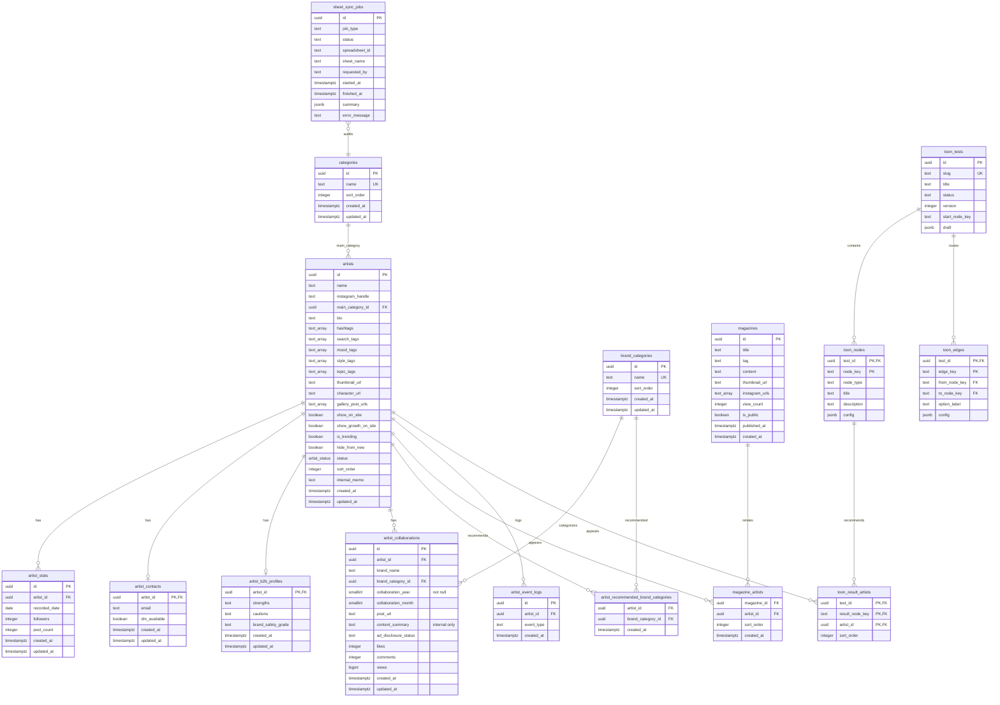

# INTOONI DB Schema

작성일: 2026-07-11

## 상태

이 문서는 refactor 목표 스키마와 현재 migration 파일 기준이다. 운영 Supabase DB에 적용했다고 뜻하지 않는다.

관련 migration:

- `supabase/migrations/202607110000_legacy_baseline.sql`
- `supabase/migrations/202607110001_db_refactor_additive.sql`
- `supabase/migrations/202607110002_security_rls_lockdown.sql`
- `supabase/migrations/202607110003_db_refactor_backfill.sql`
- `supabase/migrations/202607110004_remove_artist_ad_feature.sql`
- `supabase/migrations/202607110005_toon_test_route_map.sql`
- `supabase/migrations/202607110006_verified_legacy_cleanup.sql`
- `supabase/migrations/202607110007_add_collaboration_content_summary.sql`

`000`은 빈 로컬 DB에서도 기존 운영 스키마를 재현하기 위한 idempotent baseline이다. `006`은 검증과 JSON backup을 먼저 수행한 뒤 legacy 컬럼/테이블을 제거하는 별도 destructive cleanup이며, `007`은 협업 내용 열을 보강한다. 운영에는 아직 적용하지 않았다.

## ERD

## Target Constraints

- `artist_contacts.artist_id` is the primary key and references `artists(id)`.
- `artist_b2b_profiles.artist_id` is the primary key and references `artists(id)`.
- Artist-owned history and relation foreign keys use `ON DELETE RESTRICT`; normal Admin removal archives artists instead of deleting them.
- `artist_b2b_profiles.strengths` and `artist_b2b_profiles.cautions` are internal text fields, not public arrays.
- `artist_b2b_profiles.brand_safety_grade` is limited to `unknown`, `safe`, `normal`, or `caution` when present.
- `artist_collaborations.collaboration_year` is required and must be `>= 2000`.
- `artist_collaborations.collaboration_month` is optional and must be between `1` and `12` when present.
- `artist_collaborations.content_summary` is an internal-only description of the collaboration content.
- `artist_collaborations.likes`, `comments`, and `views` must be non-negative when present.

## 공개 데이터 원칙

`artists`와 `artist_stats` 원본 테이블은 anon/authenticated 직접 read 대상이 아니다. 공개 데이터는 server-only query와 `PublicArtistDTO` mapper를 통해서만 내려간다.

공개 필터:

- `artists.status = 'active'`
- `artists.show_on_site = true`

growth:

- `artist_stats` 최신 두 snapshot으로 계산
- `show_growth_on_site = false`이면 증가값과 증가율은 `null`
- 이전 기록이 없으면 증가값과 증가율은 `null`

## Legacy Cleanup

현재 운영 DB에는 migration 미적용으로 아래 legacy 컬럼이 남아 있다. 준비된 `202607110006_verified_legacy_cleanup.sql`은 backfill 완전성을 검사하고 `private.migration_legacy_backup`에 기존 행 전체를 JSON으로 보관한 뒤에만 이를 제거한다.

- `artists.genre`
- `artists.followers`
- `artists.post_count`
- `artists.weekly_follower_growth`
- `artists.weekly_post_growth`
- `artists.weekly_follower_growth_rate`
- `artists.weekly_post_growth_rate`
- `artists.stats_period_start`
- `artists.stats_period_end`
- `artists.last_stats_updated_at`
- `artists.is_ad`
  - `202607110004_remove_artist_ad_feature.sql` 이후 paid artist promotion에는 사용하지 않는다.
  - rollback과 기존 데이터 호환을 위해 legacy 컬럼으로만 남긴다.
- `artists.is_hot`
- `artists.hidden_tags`
- `artists.episode_formats`
- `magazines.related_artist_ids`

목표 스키마인 `supabase/schema.sql`과 `lib/database.types.ts`에는 이 컬럼 및 legacy ToonBTI 테이블이 존재하지 않는다. 운영 cleanup은 백업과 사후 검증 전에는 실행하지 않는다.

## RLS

`202607110002_security_rls_lockdown.sql` 기준:

- `artists`: anon/authenticated direct read 차단
- `artist_stats`: anon/authenticated direct read 차단
- contacts/B2B/collaboration/sheet jobs: anon/authenticated direct read 차단
- legacy ToonBTI question/option/link: anon/authenticated direct read 차단
- `magazines`: `is_public = true`만 public read
- `categories`: public read 유지
- service role은 Admin/API/Collector 경로에서 사용

## Automated Migration Guard

`tests/supabase-migrations.test.ts` verifies the prepared migration order, additive table/column creation, public role revokes, service-role grants, backfill paths, and `is_ad` ranking removal. This is a static safety check only; it does not claim the remote Supabase project has been migrated.

`tests/supabase-types-source.test.ts` verifies that `lib/supabase.ts` uses `lib/database.types.ts`, that the refactor tables are represented in the type artifact, and that the local/remote Supabase type regeneration scripts remain present.

## Backfill

`202607110003_db_refactor_backfill.sql` 기준:

- `genre` -> `categories`와 `artists.main_category_id`
- `hidden_tags` -> `search_tags`
- `is_hot` -> `is_trending`
- 현재 `followers/post_count` -> `artist_stats`
- `magazines.related_artist_ids` -> `magazine_artists`
- legacy event type -> `artist_click` 또는 `instagram_outbound`

Backfill은 기존 source columns를 삭제하지 않는다. 삭제는 검증 guard가 포함된 migration `006`에서만 수행한다.

## Magazine Relation Runtime

Public magazine detail rendering reads related artist order only from `magazine_artists`. Admin reads and saves use the join table; before production migration, Admin save alone retains an explicit missing-table fallback to the legacy array so the current deployment can still be administered.

## Admin Internal API Boundary

Signed Admin sessions access internal artist data through server-only routes:

- `/api/admin/artists/[id]/details`
- `/api/admin/artists/[id]/stats`
- `/api/admin/artists/[id]/contact`
- `/api/admin/artists/[id]/collaborations`
- `/api/admin/artists/[id]/b2b`

Stats upsert on `(artist_id, recorded_date)`, contact data preserves nullable DM state, collaboration writes validate Instagram post URLs and non-negative metrics, and B2B writes accept only the four target safety grades. These routes never participate in public rendering.

B2B profile and recommended-category replacement use the service-role-only `admin_replace_artist_b2b_profile` PostgreSQL function, so profile upsert and relation replacement commit or roll back as one transaction. Admin UI and Google Sheets Apply share this path.

## ToonBTI Route Map Runtime

- `ToonbtiRouteMapBuilder` reads and writes through authenticated `/api/admin/toon-tests`; it no longer uses browser localStorage.
- `toon_tests.draft` is the atomic canonical editor payload. Admin save also synchronizes `toon_nodes`, `toon_edges`, and `toon_result_artists`.
- Publishing validates that the graph is acyclic and fully reachable, every question has an option, every path can terminate at a result, and every result has at least one artist.
- Publishing rejects result cards that reference artists outside `status='active' AND show_on_site=true`.
- Public `/toonbti` reads only a published server DTO and filters result artists through `listPublicArtistsByIds()`.
- Legacy question/option tables are absent from the target schema and are backed up then removed by migration `006`; their API and Admin components were removed.
