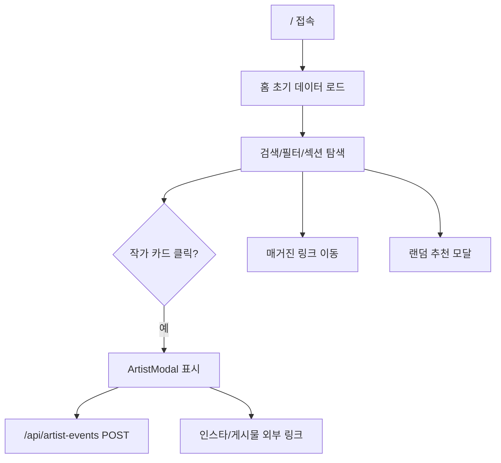
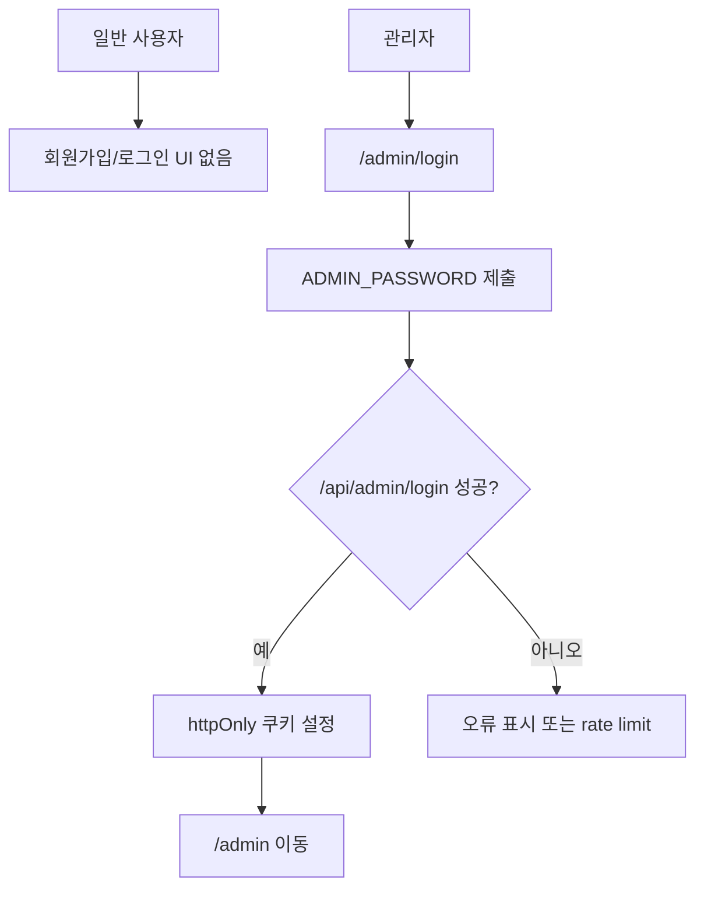
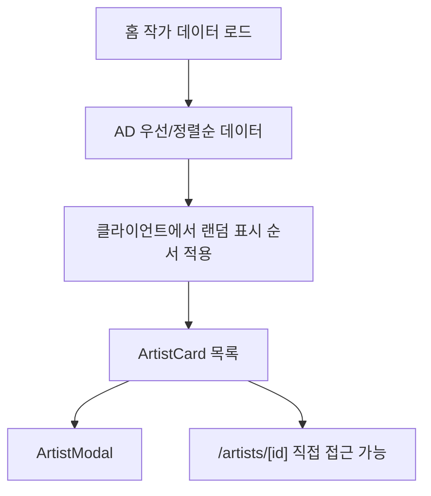
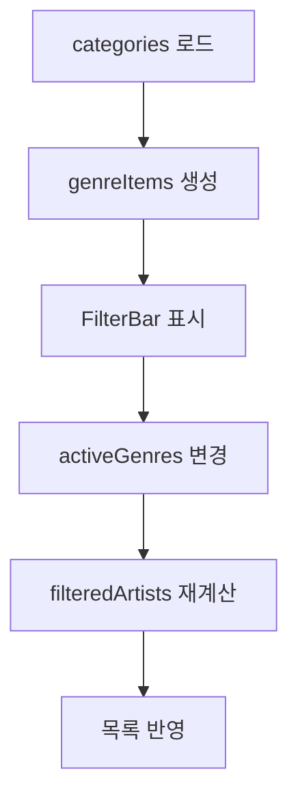
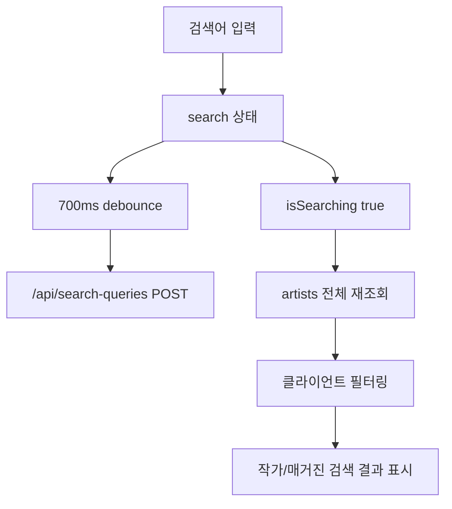
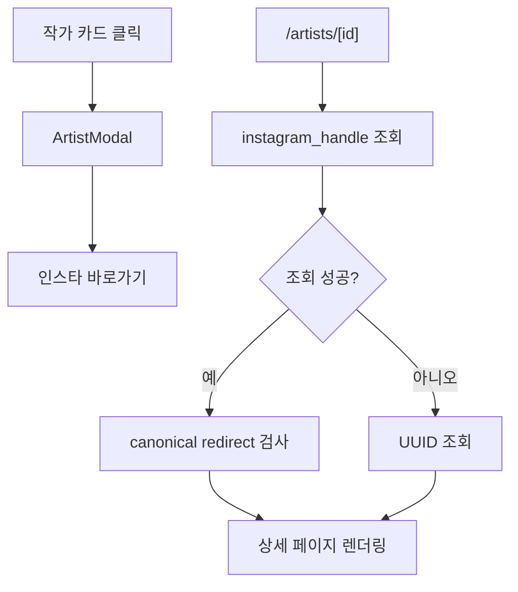
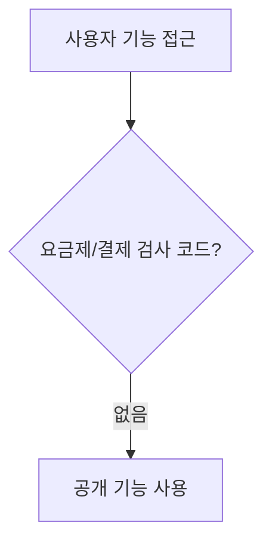
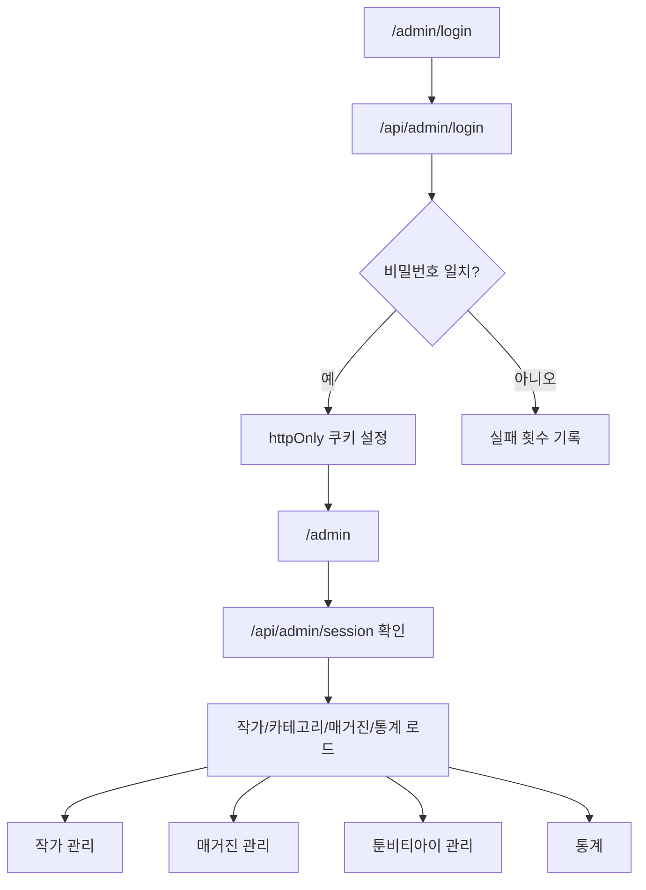
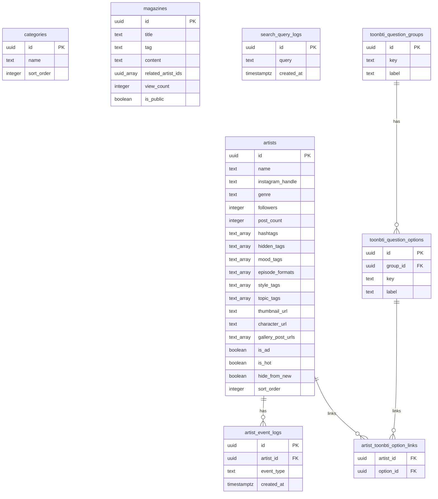

# 인투니(Intooni) 코드베이스 인수인계 문서

> 기준선 문서: 이 문서는 2026-07-11 종합 개편 전 코드 상태를 설명한다. 현재 구현과 운영 미적용 항목은 `docs/IMPLEMENTATION_STATUS_REPORT.md`를 기준으로 확인한다.

작성 기준: 이 문서는 `C:\Users\user\Desktop\Instoon` 저장소의 실제 코드와 스키마를 기준으로 작성했다. 경로는 별도 표시가 없으면 저장소 루트 기준이다. `node_modules`, `.next`, `.vercel`, 빌드 산출물, 캐시, 로그 파일은 분석 대상에서 제외했다. 환경변수는 이름만 기록하고 값은 기록하지 않는다.

## 1. 프로젝트 개요

인투니는 인스타툰 작가를 이름, 장르, 해시태그, 숨김 검색 태그, 팔로워 수, 게시물 수, 주간 성장 지표, 매거진 콘텐츠와 함께 탐색할 수 있는 웹사이트다. 홈에서는 작가 디렉터리, 카테고리 필터, 검색, 랜덤 추천, 핫 작가, 신규 작가, 성장 차트를 제공한다. 근거: `app/page.tsx`, `components/ArtistCard.tsx`, `components/FilterBar.tsx`, `components/SearchBar.tsx`.

주요 사용자 유형은 비회원 일반 방문자와 관리자다. 일반 방문자는 로그인 없이 작가 목록, 작가 모달, 작가 상세 페이지, 매거진, 툰비티아이 점검 안내 페이지를 볼 수 있다. 관리자는 `/admin/login`에서 단일 관리자 비밀번호로 로그인한 뒤 작가, 카테고리, 매거진, 툰비티아이 태그/루트맵, 통계를 관리한다. 일반 회원, 유료 회원, 결제 사용자는 코드상 확인되지 않는다. 근거: `app/admin/login/page.tsx`, `middleware.ts`, `app/admin/page.tsx`.

사용자가 수행할 수 있는 핵심 행동은 작가 검색, 장르/팔로워 필터, 작가 카드 클릭, 인스타그램 링크 이동, 게시물 링크 이동, 매거진 조회, 랜덤 작가 추천, 작가 등록 문의 링크 이동이다. 홈에서 검색어는 `/api/search-queries`로 기록되고, 작가 클릭/인스타 이동/임베드 이동/랜덤 추천/히어로 클릭은 `/api/artist-events`로 기록된다. 근거: `app/page.tsx`, `components/ArtistModal.tsx`, `components/TrackedArtistActionLink.tsx`, `app/api/search-queries/route.ts`, `app/api/artist-events/route.ts`.

주요 비즈니스 기능은 작가 디렉터리, 장르 카테고리, 공개/숨김 검색 태그, AD 작가 우선 노출, 요즘 뜨는 작가, 신규 작가 노출 제외, 주간 팔로워/게시물 성장 차트, 매거진 작성과 공개/임시저장, 작가/검색어/매거진 통계, 인스타그램 빠른 가져오기, 이미지 업로드다. 근거: `lib/types.ts`, `supabase/schema.sql`, `app/admin/page.tsx`, `components/admin/ArtistForm.tsx`, `components/admin/MagazineForm.tsx`, `components/admin/InstagramQuickImport.tsx`.

프레임워크와 핵심 라이브러리는 Next.js 14 App Router, React 18, TypeScript, Tailwind CSS, Supabase, `@hello-pangea/dnd`, `@vercel/analytics`, `clsx`다. 근거: `package.json`, `app/layout.tsx`, `tailwind.config.ts`, `components/admin/ArtistTable.tsx`.

렌더링 방식은 혼합형이다. 홈과 툰비티아이, 관리자 페이지는 `"use client"` 클라이언트 컴포넌트이고 브라우저에서 Supabase 또는 내부 API를 호출한다. 작가 상세와 매거진 목록/상세는 서버 컴포넌트로 Supabase 서버 클라이언트를 사용한다. 매거진 목록/상세와 사이트맵은 `dynamic = "force-dynamic"` 또는 `revalidate = 0`로 동적 렌더링한다. 근거: `app/page.tsx`, `app/toonbti/page.tsx`, `app/admin/page.tsx`, `app/artists/[id]/page.tsx`, `app/magazine/page.tsx`, `app/magazine/[id]/page.tsx`, `app/sitemap.ts`.

배포 방식은 README와 설정상 Vercel을 전제로 한다. 배포 플랫폼 자체 설정은 Vercel 연결을 가정하며, `.vercelignore`가 존재한다. 근거: `README.md`, `.vercelignore`, `app/layout.tsx`.

## 2. 저장소 구조

```text
app/
  layout.tsx
  page.tsx
  globals.css
  artists/[id]/page.tsx
  magazine/page.tsx
  magazine/[id]/page.tsx
  toonbti/page.tsx
  admin/layout.tsx
  admin/login/page.tsx
  admin/page.tsx
  api/
components/
  ArtistCard.tsx
  ArtistModal.tsx
  FilterBar.tsx
  SearchBar.tsx
  InstagramEmbed.tsx
  GoogleAd.tsx
  TrackedArtistActionLink.tsx
  admin/
lib/
  types.ts
  supabase.ts
  admin-auth.ts
  artist-events.ts
  magazine-content.ts
  adsense.ts
  site.ts
supabase/
  schema.sql
  weekly_growth_columns.sql
public/
package.json
next.config.mjs
middleware.ts
tailwind.config.ts
```

핵심 파일 설명:

| 경로 | 역할 | 사용 위치 | 주요 연결 관계 |
| --- | --- | --- | --- |
| `app/layout.tsx` | 전체 HTML, 메타데이터, 폰트, Vercel Analytics, AdSense 스크립트 조건부 삽입 | 모든 페이지 | `lib/site.ts`, `lib/adsense.ts`, `app/globals.css` |
| `app/page.tsx` | 홈 화면, 검색/필터/랜덤 추천/성장 차트/매거진 섹션/작가 모달 상태 | `/` | `components/ArtistCard.tsx`, `components/FilterBar.tsx`, `components/SearchBar.tsx`, `lib/supabase.ts`, `/api/search-queries`, `/api/artist-events` |
| `app/artists/[id]/page.tsx` | 작가 상세 공개 페이지, handle 또는 UUID 조회, canonical redirect, SEO 메타데이터 | `/artists/[id]` | `lib/supabase.ts`, `components/InstagramEmbed.tsx`, `lib/site.ts` |
| `app/magazine/page.tsx` | 공개 매거진 목록 | `/magazine` | `lib/supabase.ts`, `magazines` 테이블 |
| `app/magazine/[id]/page.tsx` | 공개 매거진 상세, 조회수 증가, 관련 작가 표시 | `/magazine/[id]` | `lib/magazine-content.ts`, `lib/supabase.ts`, `components/GoogleAd.tsx` |
| `app/toonbti/page.tsx` | 툰비티아이 공개 페이지. 현재 `TOONBTI_MAINTENANCE = true`로 점검 안내만 렌더링 | `/toonbti` | 유지보수 해제 시 `artists` 데이터를 브라우저 Supabase로 읽고 `ArtistModal` 사용 |
| `app/admin/page.tsx` | 관리자 콘솔 전체 상태와 탭, CRUD 요청, 통계 집계 UI | `/admin` | `components/admin/*`, `/api/artists`, `/api/categories`, `/api/magazines`, `/api/artist-events`, `/api/search-queries` |
| `app/admin/login/page.tsx` | 관리자 비밀번호 로그인 UI | `/admin/login` | `/api/admin/session`, `/api/admin/login` |
| `middleware.ts` | `/admin` 보호. `/admin/login` 제외 | 관리자 라우트 | `lib/admin-auth.ts`의 쿠키 이름 사용 |
| `app/api/*/route.ts` | 내부 API와 로깅 API | 홈/관리자/폼 | `lib/supabase.ts`, `lib/admin-auth.ts`, `lib/api-error.ts` |
| `components/admin/ArtistForm.tsx` | 작가 생성/수정 폼, 이미지 업로드, 카테고리 관리, 태그 관리 | 관리자 작가 탭 | `/api/admin/upload`, `/api/categories`, `InstagramQuickImport` |
| `components/admin/MagazineForm.tsx` | 매거진 작성/수정 에디터, 본문 토큰, 이미지/인스타 첨부 | 관리자 매거진 탭 | `lib/magazine-content.ts`, `/api/admin/upload` |
| `lib/types.ts` | Supabase 테이블 타입과 도메인 타입 | 전역 | `lib/supabase.ts`, 페이지/컴포넌트/API |
| `lib/supabase.ts` | 브라우저, 공개 서버, service role Supabase 클라이언트 생성 | 페이지/API | 환경변수 `NEXT_PUBLIC_SUPABASE_URL`, `NEXT_PUBLIC_SUPABASE_ANON_KEY`, `SUPABASE_SERVICE_ROLE_KEY` |
| `supabase/schema.sql` | 테이블, 인덱스, RLS, storage bucket 정책 | DB 초기화 | `lib/types.ts`와 대응 |

## 3. 현재 사이트 정보 구조

| URL | 페이지명 | 목적 | 주요 기능 | 대상 사용자 | 구현 파일 |
| --- | ---- | -- | ----- | ------ | ----- |
| `/` | 홈/작가 탐색 | 인스타툰 작가 탐색과 추천 | 검색, 장르 필터, 팔로워 필터, 매거진 미리보기, 핫 작가, 성장 차트, 신규 작가, 랜덤 추천, 작가 모달 | 비회원 포함 전체 방문자 | `app/page.tsx` |
| `/artists/[id]` | 작가 상세 | 특정 작가 정보와 인스타 게시물 확인 | handle/UUID 조회, canonical redirect, 팔로워/게시물/태그/메모/소개, 인스타 바로가기 | 비회원 포함 전체 방문자 | `app/artists/[id]/page.tsx` |
| `/magazine` | 매거진 목록 | 공개 매거진 목록 제공 | 공개 글만 최신순 표시 | 비회원 포함 전체 방문자 | `app/magazine/page.tsx` |
| `/magazine/[id]` | 매거진 상세 | 매거진 콘텐츠 읽기 | 토큰 기반 본문 렌더링, 조회수 증가, 관련 작가, 인스타 임베드 | 비회원 포함 전체 방문자 | `app/magazine/[id]/page.tsx`, `lib/magazine-content.ts` |
| `/toonbti` | 툰비티아이 | 취향 기반 작가 추천 기능 예정/점검 안내 | 현재 점검 안내만 표시. 비활성 코드에는 질문 선택과 추천 결과 UI 존재 | 비회원 포함 전체 방문자 | `app/toonbti/page.tsx` |
| `/admin/login` | 관리자 로그인 | 관리자 인증 | `ADMIN_PASSWORD` 입력, 세션 확인 후 `/admin` 이동 | 관리자 | `app/admin/login/page.tsx`, `app/api/admin/login/route.ts` |
| `/admin` | 관리자 콘솔 | 운영 데이터 관리 | 작가 CRUD, 카테고리 CRUD, 매거진 CRUD, 툰비티아이 태그/루트맵, 통계 | 관리자 | `app/admin/page.tsx`, `middleware.ts` |
| `/sitemap.xml` | 사이트맵 | 검색엔진용 URL 제공 | 정적 경로, 작가 상세, 공개 매거진 상세 | 검색엔진 | `app/sitemap.ts` |
| `/robots.txt` | robots | 크롤링 정책 | 전체 허용, sitemap 제공 | 검색엔진 | `app/robots.ts`, `public/robots.txt` |

로그인/권한 조건:

- 공개 페이지는 로그인 조건이 없다. 근거: `app/page.tsx`, `app/artists/[id]/page.tsx`, `app/magazine/page.tsx`, `app/magazine/[id]/page.tsx`.
- `/admin`과 하위 경로는 `middleware.ts`에서 `instoon-admin-session=authenticated` 쿠키가 없으면 `/admin/login`으로 리다이렉트된다.
- `/admin/login`은 보호 대상에서 제외된다. 근거: `middleware.ts`.

페이지 간 이동:

- 홈 상단 로고는 `/`로 이동하고, 툰비티아이 링크는 `/toonbti`로 이동한다. 근거: `app/page.tsx`.
- 홈 매거진 섹션은 `/magazine`과 `/magazine/[id]`로 이동한다. 근거: `app/page.tsx`.
- 매거진 상세의 관련 작가는 `/artists/[handle-or-id]`로 이동한다. 근거: `app/magazine/[id]/page.tsx`.
- 작가 상세에는 홈으로 돌아가는 링크와 인스타그램 외부 링크가 있다. 근거: `app/artists/[id]/page.tsx`.

## 4. 사용자 이동 흐름

### 비회원의 사이트 탐색 흐름

1. 사용자가 `/`에 접속한다.
2. 홈 클라이언트 컴포넌트가 Supabase 공개 클라이언트로 카테고리, 작가, 공개 매거진, 핫 작가를 읽는다.
3. 사용자는 검색어 입력, 장르 선택, 팔로워 수 필터, 매거진 링크, 랜덤 추천, 작가 카드를 사용한다.
4. 작가 카드를 클릭하면 모달이 열리고 클릭 이벤트가 `/api/artist-events`에 기록된다.
5. 인스타/게시물 링크를 클릭하면 이벤트 기록 후 외부 인스타그램으로 이동한다.



### 회원가입 및 로그인 흐름

일반 회원가입과 일반 사용자 로그인은 코드상 구현이 없다. 관리자 로그인만 존재한다. 근거: `app/admin/login/page.tsx`, `app/api/admin/login/route.ts`, `middleware.ts`.



### 작가 탐색 흐름

1. 홈에서 전체 작가가 `is_ad desc`, `sort_order asc`로 로드된다.
2. 검색 중이 아니면 무작위 순서 맵을 기준으로 표시된다.
3. 카드는 썸네일, 장르, 공개 해시태그, 팔로워, 게시물 수를 보여준다.
4. 카드 클릭 시 모달이 열리고 `profile_click` 이벤트가 기록된다.
5. 별도 상세 페이지는 `/artists/[instagram_handle]` 또는 UUID로 직접 접근할 수 있다.



### 카테고리 탐색 흐름

1. 홈에서 `categories`를 `sort_order` 순으로 읽는다.
2. 장르별 개수는 `artists`의 `genre` 필드로 계산한다.
3. `FilterBar`의 장르 버튼을 누르면 `activeGenres` 배열이 변경된다.
4. 홈의 `filteredArtists` 계산에서 `artist.genre`가 선택 장르에 포함되는지 검사한다.



### 검색 및 필터 흐름

1. `SearchBar` 입력값은 홈의 `search` 상태에 저장된다.
2. 700ms 후 정규화된 검색어가 `/api/search-queries`에 기록된다.
3. 검색어나 필터가 있으면 `isSearching`이 true가 되고 전체 작가를 다시 읽어 `searchArtists`에 저장한다.
4. 필터는 이름, 공개 해시태그, 숨김 태그, 메모, 공개 소개, 장르, 팔로워 범위를 클라이언트에서 검사한다.
5. 검색어가 있으면 매거진 제목/태그/본문도 클라이언트에서 필터링한다.



### 작가 상세정보 확인 흐름

1. 모달 흐름: 홈 카드 클릭 → `ArtistModal` → 인스타 링크/게시물 링크.
2. 상세 페이지 흐름: `/artists/[id]` 접근 → handle 우선 조회 → UUID 조회 → canonical handle로 redirect 가능 → 상세 렌더링.
3. 상세 페이지는 별도의 접근 제한이 없다.



### 유료 기능 또는 접근 제한 흐름

요금제, 결제, 유료회원 권한, 목록 개수 제한은 코드상 구현이 없다. 공개 페이지는 비회원도 접근 가능하다. 확인 근거: `lib/types.ts`, `supabase/schema.sql`, `app/api/*/route.ts`.



### 관리자 흐름

1. 관리자가 `/admin/login`에서 비밀번호를 제출한다.
2. `/api/admin/login`이 `ADMIN_PASSWORD`와 비교하고 성공 시 `instoon-admin-session` 쿠키를 12시간 설정한다.
3. `middleware.ts`가 `/admin` 접근 시 쿠키를 검사한다.
4. 관리자 페이지는 세션 API 확인 뒤 작가, 카테고리, 매거진, 통계 데이터를 로드한다.
5. 관리자 탭에서 CRUD와 통계 작업을 수행한다.



## 5. 레이아웃 및 내비게이션 구조

공통 레이아웃은 `app/layout.tsx`이며 HTML 언어, Google font, 전역 CSS, 기본 메타데이터, Analytics, AdSense 스크립트 조건부 삽입을 담당한다. 전역 header/footer 컴포넌트는 없다. 각 페이지가 자체 `main`, `nav`, `footer`, 광고 사이드바를 구현한다.

홈의 공통 내비게이션은 `app/page.tsx` 내부 `nav`다. 로고 `/`, 검색창, `/toonbti` 링크, 모바일/데스크톱용 툰비티아이 버튼이 있다. 홈 하단에는 푸터가 있고 이메일 문의가 표시된다. 별도 사이드바는 없지만 데스크톱 `xl` 이상에서 좌우 광고 영역을 `GoogleAd`로 둔다.

작가 상세와 매거진 상세는 좌우 광고 영역을 자체 구현한다. 작가 상세의 광고는 실제 AdSense가 아니라 회색 placeholder다. 매거진 상세은 `GoogleAd`를 사용한다. 근거: `app/artists/[id]/page.tsx`, `app/magazine/[id]/page.tsx`.

관리자 페이지는 공개 사이트와 다른 콘솔 레이아웃이다. 데스크톱에서는 좌측 사이드바, 모바일에서는 상단 탭형 내비게이션을 사용한다. 메뉴 항목은 작가 관리, 매거진 관리, 툰비티아이 관리, 통계다. 로그인 여부에 따른 메뉴 변화는 공개 사이트에는 없고, 관리자 페이지는 인증되지 않으면 빈 화면 후 로그인으로 이동한다. 근거: `app/admin/page.tsx`, `app/admin/layout.tsx`.

데스크톱과 모바일 차이는 Tailwind 반응형 클래스에 의존한다. 홈은 `md`, `xl` 기준으로 검색창/광고/그리드가 달라지고, 관리자 콘솔은 `lg` 이상에서 사이드바를 표시한다. 근거: `app/page.tsx`, `app/admin/page.tsx`, `app/globals.css`, `tailwind.config.ts`.

메뉴와 URL:

| 위치 | 항목 | URL | 조건 |
| --- | --- | --- | --- |
| 홈 nav | 로고 | `/` | 전체 |
| 홈 nav | 툰비티아이 | `/toonbti` | 전체 |
| 홈 매거진 섹션 | 더보기 | `/magazine` | 공개 매거진이 있을 때 |
| 홈 매거진 카드 | 매거진 상세 | `/magazine/[id]` | 공개 매거진 |
| 작가 상세 | 홈으로 | `/` | 전체 |
| 작가 상세/모달 | 인스타 바로가기 | 외부 Instagram | 전체 |
| 관리자 | 작가 관리 | 내부 탭 | 관리자 쿠키 필요 |
| 관리자 | 매거진 관리 | 내부 탭 | 관리자 쿠키 필요 |
| 관리자 | 툰비티아이 관리 | 내부 탭 | 관리자 쿠키 필요 |
| 관리자 | 통계 | 내부 탭 | 관리자 쿠키 필요 |

## 6. 주요 UI 컴포넌트

| 컴포넌트 | 파일 경로 | 사용 위치 | 역할 | 주요 props 또는 입력값 | 연결 데이터 |
| ---- | ----- | ----- | -- | --------------- | ------ |
| `ArtistCard` | `components/ArtistCard.tsx` | 홈 작가 목록, 신규 작가, 툰비티아이 결과 일부 | 작가 썸네일/임베드 fallback, 이름, 장르, 해시태그, 팔로워/게시물 수 표시 | `artist`, `index`, `onClick` | `Artist` |
| `ArtistModal` | `components/ArtistModal.tsx` | 홈, 툰비티아이 | 작가 상세 모달, 인스타/게시물 링크, 이벤트 추적 링크 | `artist`, `onClose` | `Artist`, `/api/artist-events` |
| `FilterBar` | `components/FilterBar.tsx` | 홈 | 장르와 팔로워 범위 필터 | `genreItems`, `activeGenres`, `activeFollowerRanges`, callbacks | `Category`, `Artist.genre`, `Artist.followers` |
| `SearchBar` | `components/SearchBar.tsx` | 홈 | 검색 입력, 예시 키워드 회전 표시 | `value`, `onChange`, `examples` | `Artist.hashtags`, `Artist.hidden_tags` |
| `InstagramEmbed` | `components/InstagramEmbed.tsx` | 작가 카드/모달/상세, 매거진, 관리자 폼 | Instagram embed script 로드와 blockquote 렌더링 | `url`, `className`, `compact` | `gallery_post_urls`, `instagram_urls`, 매거진 본문 토큰 |
| `TrackedArtistActionLink` | `components/TrackedArtistActionLink.tsx` | `ArtistModal` | 링크 클릭 시 작가 이벤트 기록 | `artistId`, `eventType`, `href` | `/api/artist-events` |
| `GoogleAd` | `components/GoogleAd.tsx` | 홈, 매거진 상세 | AdSense가 꺼져 있으면 placeholder, 켜져 있으면 광고 렌더링 | `slot`, `label`, `format`, `className` | `lib/adsense.ts` |
| `GrowthChartSection` | `app/page.tsx` 내부 | 홈 | 주간 팔로워/게시물 증가 Top 5 차트 | `artists`, `metric`, `valueMode` | `weekly_*` 필드 |
| `ArtistForm` | `components/admin/ArtistForm.tsx` | 관리자 작가 탭 | 작가 생성/수정, 태그, 이미지, 카테고리 관리 | `initialArtist`, `categories`, `stats`, `onSave` | `artists`, `categories`, `/api/admin/upload`, `/api/categories` |
| `ArtistTable` | `components/admin/ArtistTable.tsx` | 관리자 작가 탭 | 작가 목록, AD/핫 토글, 데이터 누락 표시, 삭제/수정 | `artists`, `statsByArtistId`, callbacks | `artists`, `artist_event_logs` 집계 |
| `MagazineForm` | `components/admin/MagazineForm.tsx` | 관리자 매거진 탭 | 매거진 작성/수정, 토큰 본문, 이미지/인스타 첨부, 관련 작가 | `initialMagazine`, `artists`, `onSave` | `magazines`, `artists`, `/api/admin/upload` |
| `MagazineTable` | `components/admin/MagazineTable.tsx` | 관리자 매거진 탭 | 매거진 목록, 공개/비공개, 조회수, 수정/삭제 | `magazines`, callbacks | `magazines` |
| `InstagramQuickImport` | `components/admin/InstagramQuickImport.tsx` | `ArtistForm` | 인스타 프로필/게시물 링크에서 초기값 자동 입력 | `onApply` | `/api/admin/instagram/import` |
| `ToonbtiRouteMapBuilder` | `components/admin/ToonbtiRouteMapBuilder.tsx` | 관리자 툰비티아이 탭 | 로컬스토리지 기반 질문/결과 루트맵 초안 편집 | `artists` | `localStorage`, `/api/admin/upload` |
| `ToonbtiTagManager` | `components/admin/ToonbtiTagManager.tsx` | 관리자 툰비티아이 탭 | 작가의 툰비티아이 태그 요약, 일괄 변경/삭제 | `artists`, bulk callbacks | `Artist.mood_tags`, `episode_formats`, `style_tags`, `topic_tags` |
| `ToonbtiManager` | `components/admin/ToonbtiManager.tsx` | 현재 `app/admin/page.tsx`에서 import/렌더 확인 안 됨 | DB 기반 질문 그룹/선택지 관리 컴포넌트 | `isActive` | `/api/toonbti`, `toonbti_question_*` |

페이지네이션은 관리자 작가 목록에만 확인된다. `ADMIN_ARTISTS_PER_PAGE = 20`으로 클라이언트 페이지네이션한다. 홈에는 `hasMoreArtists = false`로 무한 스크롤 UI가 사실상 비활성화되어 있다. 근거: `app/admin/page.tsx`, `app/page.tsx`.

랭킹/차트는 홈의 주간 성장 차트와 관리자 통계 차트가 있다. 근거: `app/page.tsx`, `app/admin/page.tsx`.

로그인/회원가입 컴포넌트는 관리자 로그인만 있다. 결제/요금제 UI는 구현되지 않았다. 관리자 화면은 단일 페이지 내부 탭으로 구성된다.

## 7. 데이터 모델

### 작가

- 실제 타입명: `Artist`
- 테이블: `artists`
- 필드: `id`, `name`, `instagram_handle`, `genre`, `followers`, `post_count`, `weekly_follower_growth`, `weekly_post_growth`, `weekly_follower_growth_rate`, `weekly_post_growth_rate`, `stats_period_start`, `stats_period_end`, `hashtags`, `hidden_tags`, `mood_tags`, `episode_formats`, `style_tags`, `topic_tags`, `memo`, `bio`, `thumbnail_url`, `character_url`, `gallery_post_urls`, `is_ad`, `is_hot`, `hide_from_new`, `sort_order`, `last_stats_updated_at`, `created_at`
- 의미: 작가 프로필, 인스타 계정명, 장르, 공개/숨김 검색 키워드, 툰비티아이 태그, 이미지, 대표 게시물, 광고/추천/신규 노출 제어, 성장 지표를 한 테이블에 보관한다.
- 관계: `artist_event_logs.artist_id`가 `artists.id`를 참조한다. `magazines.related_artist_ids`는 UUID 배열로 작가 ID를 저장하지만 DB FK는 아니다. `artist_toonbti_option_links.artist_id`가 `artists.id`를 참조하지만 현재 공개 툰비티아이 페이지는 이 링크 테이블을 사용하지 않는다.
- 읽기/수정 파일: `app/page.tsx`, `app/artists/[id]/page.tsx`, `app/api/artists/route.ts`, `app/admin/page.tsx`, `components/admin/ArtistForm.tsx`, `components/admin/ArtistTable.tsx`, `app/toonbti/page.tsx`.
- 화면 표시: 홈 카드/모달/히어로/차트/랜덤 추천, 작가 상세, 매거진 관련 작가, 관리자 작가/통계, 툰비티아이 비활성 코드.
- 근거: `lib/types.ts`, `supabase/schema.sql`.

### 인스타그램 계정

독립 엔티티/테이블은 없다. `Artist.instagram_handle`, `Artist.gallery_post_urls`, `thumbnail_url`, `bio`, `followers`, `post_count`에 포함된다. 인스타 빠른 가져오기는 외부 Instagram HTML 메타태그에서 일부 값을 파싱해 `ArtistFormValues`에 반영한다. 근거: `components/admin/InstagramQuickImport.tsx`, `app/api/admin/instagram/import/route.ts`.

### 카테고리

- 실제 타입명: `Category`
- 테이블: `categories`
- 필드: `id`, `name`, `sort_order`, `created_at`
- 의미: 홈 장르 필터와 작가 폼의 장르 선택지.
- 관계: `artists.genre`는 문자열로 category name을 저장한다. DB FK는 없다.
- 읽기/수정 파일: `app/page.tsx`, `app/api/categories/route.ts`, `components/admin/ArtistForm.tsx`, `app/admin/page.tsx`.
- 화면 표시: 홈 필터, 작가 폼 카테고리 관리.

### 팔로워 기록 / 게시물 기록

별도 기록 테이블은 없다. 현재 값과 주간 증가 수/증가율이 `artists` 필드에 저장된다. 이전 값의 이력은 코드상 확인되지 않는다. 근거: `lib/types.ts`, `supabase/schema.sql`, `supabase/weekly_growth_columns.sql`.

### 사용자

일반 사용자 모델/테이블은 없다. Supabase Auth 사용자 테이블을 사용하는 코드도 확인되지 않는다. 관리자도 DB 사용자가 아니라 `ADMIN_PASSWORD`와 쿠키로 처리된다. 근거: `lib/types.ts`, `lib/admin-auth.ts`, `app/api/admin/login/route.ts`.

### 북마크 또는 관심 작가

구현 없음. 관련 테이블, 타입, API, UI가 확인되지 않는다.

### 검색 기록

- 실제 타입명: `SearchQueryLog`
- 테이블: `search_query_logs`
- 필드: `id`, `query`, `created_at`
- 의미: 홈 검색어 기록과 관리자 검색 통계.
- 관계: 작가나 사용자와 연결되지 않는다.
- 읽기/수정 파일: `app/page.tsx`, `app/api/search-queries/route.ts`, `app/admin/page.tsx`.
- 화면 표시: 관리자 통계 탭.

### 요금제 / 결제

구현 없음. 타입, 테이블, API, UI가 확인되지 않는다.

### 관리자 데이터

독립 관리자 테이블은 없다. 관리자 인증은 환경변수 `ADMIN_PASSWORD`와 쿠키 `instoon-admin-session`으로 처리한다. 관리자 화면의 데이터는 작가, 카테고리, 매거진, 이벤트 로그, 검색 로그를 service role로 읽고 수정한다. 근거: `lib/admin-auth.ts`, `middleware.ts`, `app/api/admin/*/route.ts`.

### 매거진

- 실제 타입명: `Magazine`
- 테이블: `magazines`
- 필드: `id`, `title`, `tag`, `content`, `thumbnail_url`, `related_artist_ids`, `instagram_urls`, `view_count`, `is_public`, `published_at`, `created_at`
- 의미: 블로그/매거진 콘텐츠와 관련 작가 연결.
- 관계: `related_artist_ids`가 작가 UUID 배열이지만 DB FK는 아니다.
- 읽기/수정 파일: `app/page.tsx`, `app/magazine/page.tsx`, `app/magazine/[id]/page.tsx`, `app/api/magazines/route.ts`, `components/admin/MagazineForm.tsx`, `components/admin/MagazineTable.tsx`.
- 화면 표시: 홈 매거진 섹션, 매거진 목록/상세, 관리자 매거진 탭.

### 이벤트 로그

- 실제 타입명: `ArtistEventLog`
- 테이블: `artist_event_logs`
- 필드: `id`, `artist_id`, `event_type`, `created_at`
- 의미: 작가 관련 클릭/이동/추천 반응 기록.
- 관계: `artist_id`가 `artists.id`를 FK로 참조한다.
- 읽기/수정 파일: `components/TrackedArtistActionLink.tsx`, `app/page.tsx`, `app/toonbti/page.tsx`, `app/api/artist-events/route.ts`, `app/admin/page.tsx`.
- 화면 표시: 관리자 작가 통계/운영 통계.

### 툰비티아이 질문 데이터

- 실제 타입명: `ToonbtiQuestionGroup`, `ToonbtiQuestionOption`, `ArtistToonbtiOptionLink`
- 테이블: `toonbti_question_groups`, `toonbti_question_options`, `artist_toonbti_option_links`
- 의미: DB 기반 질문 그룹/선택지와 작가 연결 모델.
- 읽기/수정 파일: `app/api/toonbti/route.ts`, `components/admin/ToonbtiManager.tsx`.
- 화면 표시: `ToonbtiManager` 컴포넌트 기준으로 관리자에서 관리 가능하지만, 현재 `app/admin/page.tsx`에서는 `ToonbtiManager` import/렌더를 확인하지 못했다. 현재 관리자 툰비티아이 탭은 `ToonbtiRouteMapBuilder`, `ToonbtiTagManager`를 렌더링한다.

TypeScript 타입과 SQL 스키마 차이:

- `artists.weekly_follower_growth_rate`, `weekly_post_growth_rate`는 SQL에서 `numeric`, TypeScript에서 `number`다.
- `artists.stats_period_start`, `stats_period_end`는 SQL에서 `date`, TypeScript에서 `string | null`이다.
- `magazines.related_artist_ids`는 SQL에서 `uuid[]`, TypeScript에서 `string[]`이다.
- `Database.Relationships`는 대부분 빈 배열로 typed 되어 있어 FK 관계가 타입에 반영되지 않는다.
- 근거: `lib/types.ts`, `supabase/schema.sql`.

## 8. 데이터베이스 구조

사용 데이터베이스는 Supabase Postgres다. ORM은 없고 `@supabase/supabase-js`와 `@supabase/ssr` 클라이언트를 직접 사용한다. 근거: `lib/supabase.ts`, `package.json`.

주요 테이블:

- `artists`: 작가 프로필과 노출/검색/추천/성장 지표.
- `categories`: 홈 장르 필터와 작가 폼 장르 선택지.
- `magazines`: 매거진 글과 공개 여부/조회수/관련 작가.
- `artist_event_logs`: 작가 클릭 이벤트.
- `search_query_logs`: 검색어 로그.
- `toonbti_question_groups`, `toonbti_question_options`, `artist_toonbti_option_links`: DB 기반 툰비티아이 질문/선택지/작가 연결.

인덱스와 검색 관련 설정은 이름/장르/sort_order/이벤트 생성일/검색어 생성일 중심이다. 전문 검색 인덱스는 확인되지 않는다. 홈 검색은 클라이언트에서 문자열 `includes`로 처리한다. 근거: `supabase/schema.sql`, `app/page.tsx`.

마이그레이션 구조는 단일 `supabase/schema.sql`과 보조 `supabase/weekly_growth_columns.sql` 파일이다. 정식 마이그레이션 디렉터리 구조는 확인되지 않는다.

서버에서 데이터를 가져오는 주요 코드는 `app/artists/[id]/page.tsx`, `app/magazine/page.tsx`, `app/magazine/[id]/page.tsx`, `app/api/*/route.ts`, `app/sitemap.ts`다. 클라이언트에서 직접 DB에 접근하는 코드는 `app/page.tsx`와 `app/toonbti/page.tsx`의 `getSupabaseBrowserClient()` 사용이다. 관리자 화면은 내부 API를 주로 호출한다. 근거: `lib/supabase.ts`.

RLS/권한:

- `artists`, `categories`, `magazines`, `toonbti_question_groups`, `toonbti_question_options`, `artist_toonbti_option_links`는 공개 select 정책이 있다.
- `artist_event_logs`, `search_query_logs`는 service role select/insert/delete grant가 있다.
- `magazines`에는 `"Prototype manage magazines"` 정책이 `for all using (true) with check (true)`로 존재한다. 이는 RLS 관점에서 강한 주의가 필요한 지점이다. 실제 API는 관리자 인증을 검사하지만 DB 정책 자체는 넓다. 근거: `supabase/schema.sql`, `app/api/magazines/route.ts`.



## 9. API 및 서버 로직

| 방식 | 경로 | 목적 | 입력 | 출력 | 인증 필요 여부 | 구현 파일 |
| -- | -- | -- | -- | -- | -------- | ----- |
| GET | `/api/artists` | 작가 목록 조회 | 없음 | `Artist[]` | 불필요 | `app/api/artists/route.ts` |
| POST | `/api/artists` | 작가 생성 | `ArtistInsert` | 생성된 `Artist` | 관리자 | `app/api/artists/route.ts` |
| PUT | `/api/artists` | 작가 수정 또는 reorder | `ArtistInsert` 또는 `{mode:"reorder"}` | 수정된 `Artist` 또는 success | 관리자 | `app/api/artists/route.ts` |
| DELETE | `/api/artists` | 작가 삭제와 이미지 삭제 | `{id}` | `{success:true}` | 관리자 | `app/api/artists/route.ts` |
| GET | `/api/categories` | 카테고리 목록 | 없음 | `Category[]` | 불필요 | `app/api/categories/route.ts` |
| POST/PUT/DELETE | `/api/categories` | 카테고리 생성/수정/삭제 | name/id | category 또는 success | 관리자 | `app/api/categories/route.ts` |
| GET | `/api/magazines` | 매거진 목록. 관리자는 전체, 비관리자는 공개만 | 없음 | `Magazine[]` | 읽기는 조건부 | `app/api/magazines/route.ts` |
| POST/PUT/DELETE | `/api/magazines` | 매거진 CRUD와 이미지 정리 | `MagazineInsert` 또는 id | magazine 또는 success | 관리자 | `app/api/magazines/route.ts` |
| POST | `/api/artist-events` | 작가 이벤트 기록 | `{artistId,eventType}` | `{success:true}` | 불필요 | `app/api/artist-events/route.ts` |
| GET | `/api/artist-events?period=` | 작가 이벤트 집계 | `period=day/week/year/all` | `{period,stats}` | 관리자 | `app/api/artist-events/route.ts` |
| POST | `/api/search-queries` | 검색어 기록 | `{query}` | `{success:true}` | 불필요 | `app/api/search-queries/route.ts` |
| GET | `/api/search-queries?period=` | 검색어 집계 | `period` | `{period,queries}` | 관리자 | `app/api/search-queries/route.ts` |
| GET | `/api/toonbti` | DB 기반 툰비티아이 그룹/옵션 조회 | 없음 | `{groups,options}` | 코드상 불필요 | `app/api/toonbti/route.ts` |
| POST/PUT/DELETE | `/api/toonbti` | 툰비티아이 그룹/옵션 CRUD | entity payload | group/option/success | 관리자 | `app/api/toonbti/route.ts` |
| POST | `/api/admin/login` | 관리자 로그인 | `{password}` | `{success:true}` | 비밀번호 | `app/api/admin/login/route.ts` |
| POST | `/api/admin/logout` | 관리자 로그아웃 | 없음 | `{success:true}` | 쿠키 삭제 | `app/api/admin/logout/route.ts` |
| GET | `/api/admin/session` | 관리자 세션 확인 | 없음 | `{authenticated}` | 불필요 | `app/api/admin/session/route.ts` |
| POST | `/api/admin/upload` | 이미지 업로드 | multipart `file`, `folder` | `{publicUrl,path}` | 관리자 | `app/api/admin/upload/route.ts` |
| POST | `/api/admin/instagram/import` | Instagram 프로필/게시물 링크 파싱 | `{profileUrl,postUrls}` | profile/posts/warnings | 관리자 | `app/api/admin/instagram/import/route.ts` |

외부 API/서비스:

- Supabase Database/Storage: 모든 데이터와 이미지 업로드.
- Instagram 웹 HTML과 embed script: 빠른 가져오기와 게시물 임베드. 근거: `app/api/admin/instagram/import/route.ts`, `components/InstagramEmbed.tsx`.
- Google AdSense: 현재 `ADSENSE_ENABLED = false`라 렌더링은 placeholder다. 근거: `lib/adsense.ts`, `components/GoogleAd.tsx`.
- Vercel Analytics: `app/layout.tsx`.

서버 액션은 확인되지 않는다. 데이터 수집/크롤링은 관리자 수동 POST `/api/admin/instagram/import`만 확인된다. 예약/동기화 작업은 확인되지 않는다.

## 10. 상태 관리와 데이터 흐름

전역 상태 관리 라이브러리는 없다. 서버 상태는 Supabase와 내부 API에서 가져오며, 클라이언트 상태는 React `useState`, `useMemo`, `useEffect`로 관리한다. URL 쿼리 파라미터는 홈 검색/필터 상태에 사용되지 않는다. 관리자 통계 API만 `period` 쿼리 파라미터를 사용한다. 근거: `app/page.tsx`, `app/admin/page.tsx`, `app/api/artist-events/route.ts`, `app/api/search-queries/route.ts`.

검색/필터 상태는 홈 컴포넌트 내부 상태(`search`, `activeGenres`, `activeFollowerRanges`, `showFollowerFilters`)에 저장된다. 새로고침하면 유지되지 않는다. 로컬스토리지는 `ToonbtiRouteMapBuilder`의 관리자 루트맵 초안에만 확인된다. 쿠키는 관리자 세션에 사용된다. 근거: `components/admin/ToonbtiRouteMapBuilder.tsx`, `lib/admin-auth.ts`.

캐싱/재검증은 명시적으로 제한하는 곳이 있다. 매거진 페이지는 `dynamic = "force-dynamic"`, `revalidate = 0`, API fetch는 관리자에서 `cache: "no-store"`를 사용한다. 홈의 브라우저 Supabase 조회는 별도 캐시가 없다. 근거: `app/magazine/page.tsx`, `app/magazine/[id]/page.tsx`, `app/admin/page.tsx`.

대표 데이터 흐름:

1. `검색어 입력 → SearchBar → search 상태 변경 → /api/search-queries POST → search_query_logs INSERT → 관리자 통계에 반영`
   - 근거: `components/SearchBar.tsx`, `app/page.tsx`, `app/api/search-queries/route.ts`, `app/admin/page.tsx`.

2. `작가 카드 클릭 → ArtistCard onClick → selectedArtist 상태 변경 + /api/artist-events POST → artist_event_logs INSERT → ArtistModal 표시 + 관리자 통계 반영`
   - 근거: `components/ArtistCard.tsx`, `app/page.tsx`, `app/api/artist-events/route.ts`, `components/ArtistModal.tsx`.

3. `관리자 작가 저장 → ArtistForm submit → app/admin/page.tsx persistArtist → /api/artists POST/PUT → artists INSERT/UPDATE → fetchArtists 재호출 → 관리자 목록 반영`
   - 근거: `components/admin/ArtistForm.tsx`, `app/admin/page.tsx`, `app/api/artists/route.ts`.

4. `매거진 상세 접근 → 서버 컴포넌트 → publicSupabase로 공개 매거진 조회 → adminSupabase로 view_count 증가 → 본문 토큰 파싱 → 화면 렌더링`
   - 근거: `app/magazine/[id]/page.tsx`, `lib/magazine-content.ts`.

5. `관리자 툰비티아이 루트맵 편집 → RouteMapBuilder 상태 변경 → localStorage 저장 → 새로고침 후 localStorage 복원`
   - 근거: `components/admin/ToonbtiRouteMapBuilder.tsx`.

## 11. 인증과 권한

인증 도구는 별도 인증 서비스가 아니라 자체 관리자 쿠키 방식이다. `ADMIN_PASSWORD` 환경변수와 요청 비밀번호를 비교한다. 성공하면 `instoon-admin-session`이라는 httpOnly 쿠키를 12시간 설정한다. 근거: `lib/admin-auth.ts`, `app/api/admin/login/route.ts`.

세션 관리는 쿠키 값이 문자열 `"authenticated"`인지 확인하는 방식이다. `middleware.ts`, `isAdminAuthenticated()`, `/api/admin/session`이 같은 쿠키 값을 검사한다. 근거: `middleware.ts`, `lib/admin-auth.ts`, `app/api/admin/session/route.ts`.

사용자 역할은 코드상 관리자만 있다. 일반회원, 유료회원 역할 구분은 구현되어 있지 않다. 보호된 페이지는 `/admin` 계열이며 `/admin/login`은 제외된다. 서버 측 권한 검증은 관리자 쓰기 API 대부분에서 `isAdminAuthenticated()`로 수행된다. 근거: `app/api/artists/route.ts`, `app/api/categories/route.ts`, `app/api/magazines/route.ts`, `app/api/admin/upload/route.ts`.

취약하거나 불명확한 부분:

- 관리자 쿠키 값이 고정 문자열이다. 쿠키 탈취 시 별도 서버 세션/서명 검증은 확인되지 않는다. 근거: `app/api/admin/login/route.ts`, `middleware.ts`.
- 로그인 rate limit은 서버 메모리 `Map` 기반이라 서버리스/다중 인스턴스 환경에서 일관성이 약할 수 있다. 근거: `lib/admin-auth.ts`.
- `/api/toonbti` GET은 관리자 인증 없이 service role로 그룹/옵션을 읽는다. 데이터 자체가 공개 가능한지 결정이 필요하다. 근거: `app/api/toonbti/route.ts`.
- `magazines` 테이블의 `"Prototype manage magazines"` RLS 정책이 `for all using (true)`로 존재한다. API는 인증을 확인하지만 DB 정책은 매우 넓다. 근거: `supabase/schema.sql`.
- 공개 홈 클라이언트가 Supabase 공개 키로 `artists`, `categories`, `magazines`를 직접 읽는다. 비공개 필드가 `artists`에 섞이면 그대로 공개될 수 있다. 근거: `app/page.tsx`, `supabase/schema.sql`, `lib/types.ts`.

## 12. 요금제와 기능 제한

요금제와 결제 기능은 코드상 구현되어 있지 않다. 무료/회원가입/유료 사용자 구분, 결제 후 권한 반영, 유료 목록 제한, 유료 상세 제한, 검색/필터 제한은 확인되지 않는다.

현재 실제 기능 제한:

- 관리자 화면은 관리자 쿠키가 필요하다. 근거: `middleware.ts`.
- 홈 무한 스크롤은 `hasMoreArtists = false`로 더 불러오기 기능이 비활성 상태다. 근거: `app/page.tsx`.
- 관리자 작가 목록은 페이지당 20개로 클라이언트 페이지네이션한다. 근거: `app/admin/page.tsx`.
- 매거진 공개 페이지/API는 비관리자에게 `is_public = true`만 보여준다. 근거: `app/magazine/page.tsx`, `app/magazine/[id]/page.tsx`, `app/api/magazines/route.ts`.
- `app/toonbti/page.tsx`는 현재 점검 상태 상수로 추천 경험을 막는다. 근거: `TOONBTI_MAINTENANCE = true`.

## 13. 스타일 및 디자인 시스템

CSS 방식은 Tailwind CSS와 전역 CSS 혼합이다. `tailwind.config.ts`에 색상 토큰과 `Cafe24Moyamoya` 폰트 확장이 있고, `app/globals.css`에는 CSS 변수, 공통 컴포넌트 클래스, 애니메이션, 매거진 rich editor/preview 스타일이 있다.

UI 라이브러리는 별도 컴포넌트 라이브러리 없이 직접 구현한다. 드래그 앤 드롭은 `@hello-pangea/dnd`를 관리자 작가 테이블에서 사용한다. 근거: `package.json`, `components/admin/ArtistTable.tsx`.

색상/폰트/간격:

- 주요 색상: `#ff4d6d` accent/coral, `#1a1a1a` text, `#f8f7f4` background, `#edecff` tag 등.
- 폰트: Next Google font `Noto_Sans_KR`, `Plus_Jakarta_Sans`, 로컬 `Cafe24Moyamoya`.
- 반응형 기준: Tailwind 기본 breakpoint(`md`, `lg`, `xl`) 사용.
- 근거: `tailwind.config.ts`, `app/layout.tsx`, `app/globals.css`.

중복/페이지별 차이:

- 홈, 작가 상세, 매거진 상세, 툰비티아이 페이지가 각자 nav/광고/레이아웃을 직접 구현한다.
- 카드 스타일은 `ArtistCard`, 홈 내부 `HorizontalArtistCard`, `NewArtistGridCard`, 매거진 관련 작가 카드 등으로 일부 중복된다.
- 매거진 카드는 전역 `.magazine-card` 클래스와 페이지별 Tailwind 카드가 혼재한다.
- 관리자 UI는 `panel-surface`, `switch-track` 같은 전역 클래스와 각 컴포넌트 Tailwind가 혼합된다.

## 14. 외부 서비스 및 환경변수

| 서비스 | 사용 목적 | 관련 파일 | 환경변수 이름 |
| --- | ----- | ----- | ------- |
| Supabase Database | 작가, 카테고리, 매거진, 로그, 툰비티아이 데이터 저장 | `lib/supabase.ts`, `supabase/schema.sql` | `NEXT_PUBLIC_SUPABASE_URL`, `NEXT_PUBLIC_SUPABASE_ANON_KEY`, `SUPABASE_SERVICE_ROLE_KEY` |
| Supabase Storage | 작가/캐릭터/매거진/툰비티아이 이미지 업로드와 공개 URL | `app/api/admin/upload/route.ts`, `supabase/schema.sql` | `NEXT_PUBLIC_SUPABASE_URL`, `SUPABASE_SERVICE_ROLE_KEY` |
| 관리자 자체 인증 | 관리자 비밀번호 비교 | `lib/admin-auth.ts`, `app/api/admin/login/route.ts` | `ADMIN_PASSWORD` |
| Vercel | 배포, 사이트 URL fallback, Analytics | `README.md`, `.vercelignore`, `lib/site.ts`, `app/layout.tsx` | `VERCEL_URL`, `VERCEL_OIDC_TOKEN`(코드 직접 사용은 확인되지 않음) |
| 사이트 URL | metadata/canonical/OG URL | `lib/site.ts`, `app/layout.tsx`, `app/artists/[id]/page.tsx` | `NEXT_PUBLIC_SITE_URL` |
| Instagram | 게시물 임베드, 관리자 빠른 가져오기 | `components/InstagramEmbed.tsx`, `app/api/admin/instagram/import/route.ts` | 없음 |
| Google AdSense | 광고 스크립트/slot. 현재 비활성 | `lib/adsense.ts`, `components/GoogleAd.tsx`, `app/layout.tsx` | 없음 |
| Vercel Analytics | 방문 분석 | `app/layout.tsx` | 없음 |

`.env.example`에는 `ADMIN_PASSWORD`, `NEXT_PUBLIC_SUPABASE_ANON_KEY`, `NEXT_PUBLIC_SUPABASE_URL`, `SUPABASE_SERVICE_ROLE_KEY`가 있다. `.env.local`에서 확인한 변수 이름은 `ADMIN_PASSWORD`, `NEXT_PUBLIC_SUPABASE_ANON_KEY`, `NEXT_PUBLIC_SUPABASE_URL`, `SUPABASE_SERVICE_ROLE_KEY`, `VERCEL_OIDC_TOKEN`이다. 값은 기록하지 않았다.

## 15. 실행 및 배포 구조

로컬 실행 명령:

- `npm install`
- `npm.cmd run dev` 또는 `npm run dev`
- 사용자 페이지: `http://localhost:3000`
- 관리자 로그인: `http://localhost:3000/admin/login`

빌드/실행/린트 명령:

- 개발: `npm run dev`
- 빌드: `npm run build`
- 프로덕션 실행: `npm run start`
- 린트: `npm run lint`
- 테스트: `package.json`에 테스트 스크립트가 없다. 확인 불가가 아니라 구현 없음.

배포 플랫폼은 README 기준 Vercel이다. 배포 설정 파일로 `.vercelignore`가 있고, `.vercel` 디렉터리는 분석 제외했다. 필요한 환경변수 이름은 Supabase 공개 URL/anon key, service role key, 관리자 비밀번호, 선택적으로 사이트 URL/Vercel URL이다. 근거: `README.md`, `.vercelignore`, `lib/site.ts`, `lib/supabase.ts`.

예약 작업 또는 백그라운드 작업은 코드상 확인되지 않는다. 데이터 업데이트는 관리자 콘솔에서 수동으로 작가/매거진/태그 값을 저장하거나, Instagram 빠른 가져오기 API를 수동 호출하는 방식이다. 주간 성장 데이터도 자동 계산이 아니라 `ArtistForm` 입력 필드와 SQL 컬럼만 확인된다. 근거: `components/admin/ArtistForm.tsx`, `supabase/weekly_growth_columns.sql`.

## 16. 현재 구조의 문제 후보

### 확실하게 확인된 문제

- `magazines` 테이블에 `"Prototype manage magazines"` RLS 정책이 `for all using (true) with check (true)`로 남아 있다. API는 관리자 인증을 하더라도 DB 정책 자체는 광범위하다. 근거: `supabase/schema.sql`.
- `ToonbtiManager` 컴포넌트와 `/api/toonbti`는 DB 기반 질문/선택지 모델을 관리하지만, 현재 관리자 페이지에서는 `ToonbtiRouteMapBuilder`와 `ToonbtiTagManager`만 렌더링한다. 두 툰비티아이 관리 모델의 책임이 분리되지 않았다. 근거: `components/admin/ToonbtiManager.tsx`, `components/admin/ToonbtiRouteMapBuilder.tsx`, `components/admin/ToonbtiTagManager.tsx`, `app/admin/page.tsx`.
- 공개 툰비티아이 페이지는 추천 경험 코드가 존재하지만 `TOONBTI_MAINTENANCE = true`로 점검 안내만 표시한다. 근거: `app/toonbti/page.tsx`.
- 홈의 `hasMoreArtists = false`로 무한 스크롤 안내/로직 일부가 있으나 실제 추가 로드가 동작하지 않는다. 근거: `app/page.tsx`.
- `sitemap.ts`는 `SITE_URL = "https://intooni.com"` 상수를 사용하고, `lib/site.ts`의 `NEXT_PUBLIC_SITE_URL` 로직과 분리되어 있다. 근거: `app/sitemap.ts`, `lib/site.ts`.

### 구조상 위험 가능성이 있는 부분

- 공개 브라우저 클라이언트가 `artists.select("*")`를 수행한다. 작가 테이블에 운영 메모나 숨김 태그 등 공개 여부가 애매한 필드가 추가되면 그대로 노출될 수 있다. 근거: `app/page.tsx`, `supabase/schema.sql`.
- 홈 검색은 클라이언트 전체 로드 후 `includes` 필터다. 데이터가 커지면 초기 로드와 검색 성능, 공개 데이터 범위가 문제가 될 수 있다. 근거: `app/page.tsx`.
- 관리자 로그인 rate limit이 메모리 Map 기반이라 서버리스 환경에서 인스턴스별로 분리될 가능성이 있다. 추정. 근거: `lib/admin-auth.ts`.
- 매거진 상세에서 조회수 증가가 페이지 렌더링 중 service role update로 수행된다. 봇/새로고침 중복 증가나 동시성 정책이 없다. 근거: `app/magazine/[id]/page.tsx`.
- `magazines.related_artist_ids`와 `artists.genre`가 DB FK 없이 문자열/배열로 연결된다. 카테고리명 변경이나 작가 삭제 시 참조 정합성 관리가 애플리케이션 책임이다. 근거: `supabase/schema.sql`, `app/api/categories/route.ts`, `app/api/magazines/route.ts`.

### 중복 또는 책임이 불명확한 부분

- 작가 상세 UI가 `ArtistModal`과 `/artists/[id]` 페이지에 각각 구현되어 있다. 표시 필드와 링크 추적 방식이 완전히 같지 않다. 근거: `components/ArtistModal.tsx`, `app/artists/[id]/page.tsx`.
- 홈 내부에 `HorizontalArtistCard`, `NewArtistGridCard`, `GrowthChartSection`, `NewArtistsSection` 등 많은 UI가 한 파일에 포함되어 홈의 책임이 크다. 근거: `app/page.tsx`.
- 툰비티아이 데이터는 `artists`의 태그 배열, DB 질문/옵션 테이블, localStorage 루트맵 초안이 병존한다. 근거: `lib/types.ts`, `app/api/toonbti/route.ts`, `components/admin/ToonbtiRouteMapBuilder.tsx`, `components/admin/ToonbtiTagManager.tsx`.
- `public/robots.txt`와 `app/robots.ts`가 모두 존재한다. Next App Router에서 어느 쪽이 최종 제공되는지 배포 결과 확인이 필요하다. 확인 불가. 근거: `public/robots.txt`, `app/robots.ts`.

### 개편 시 영향 범위가 큰 부분

- `lib/types.ts`: 도메인 타입과 Supabase Database 타입의 중심. 필드 변경 시 페이지, API, 관리자 폼 전체에 영향.
- `supabase/schema.sql`: 실제 DB 구조, RLS, 인덱스, storage 정책. 데이터 모델 개편의 핵심.
- `app/page.tsx`: 홈 정보 구조, 검색/필터/추천/통계/랜덤/매거진이 집중되어 있어 IA 개편 영향이 크다.
- `app/admin/page.tsx`: 관리자 데이터 로드/저장/통계/탭이 집중되어 있어 관리자 IA 개편 영향이 크다.
- `components/admin/ArtistForm.tsx`: 작가 필드 대부분을 직접 편집하므로 작가 모델 변경 영향이 크다.
- `app/api/artists/route.ts`: 작가 CRUD, 이미지 삭제, 정렬 변경, 통계 갱신 시간이 묶여 있다.
- `lib/magazine-content.ts`: 매거진 본문 저장 포맷과 렌더링 파서의 중심. 에디터 개편 시 중요.

## 17. 개편 논의를 위해 결정해야 할 질문

- `artists` 테이블의 `memo`, `hidden_tags`, `bio`, `gallery_post_urls` 중 무엇을 공개 API/브라우저 클라이언트에서 내려도 되는가? 홈은 현재 `select("*")`로 전체 필드를 읽는다. 근거: `app/page.tsx`, `lib/types.ts`.
- 카테고리를 독립 엔티티로 유지할 것인가, 아니면 작가 `genre` 문자열과 완전히 통합할 것인가? 현재 `categories.name`과 `artists.genre` 사이에 FK가 없다. 근거: `supabase/schema.sql`, `components/admin/ArtistForm.tsx`.
- 홈의 “전체 작가”, “요즘 뜨는 작가”, “신규 작가”, “성장 차트”를 하나의 작가 탐색 페이지에 둘 것인가, 랭킹/추천/디렉터리 페이지로 분리할 것인가? 현재 모두 `app/page.tsx`에 집중되어 있다.
- 작가 상세을 공개 SEO 페이지로 계속 유지할 것인가, 모달 중심 탐색으로 축소할 것인가? 현재 모달과 상세 페이지가 둘 다 존재한다. 근거: `components/ArtistModal.tsx`, `app/artists/[id]/page.tsx`.
- 숨김 검색 태그는 운영용 검색 품질 보강 데이터인가, 공개 가능한 추천 키워드인가? 현재 홈 검색에 사용되지만 화면에는 표시하지 않는다. 근거: `app/page.tsx`, `components/admin/ArtistForm.tsx`.
- 툰비티아이의 진짜 데이터 원천을 무엇으로 둘 것인가? 현재 작가 배열 태그, DB 질문/옵션 테이블, localStorage 루트맵 초안이 병존한다. 근거: `app/toonbti/page.tsx`, `app/api/toonbti/route.ts`, `components/admin/ToonbtiRouteMapBuilder.tsx`.
- 주간 성장 지표는 수동 입력으로 유지할 것인가, 팔로워/게시물 이력 테이블을 만들어 자동 계산할 것인가? 현재 이력 테이블은 없다. 근거: `supabase/weekly_growth_columns.sql`, `components/admin/ArtistForm.tsx`.
- 매거진을 SEO 콘텐츠 허브로 키울 것인가, 작가 탐색 보조 콘텐츠로 둘 것인가? 현재 관련 작가 연결은 `related_artist_ids` 배열이고 FK가 없다. 근거: `app/magazine/[id]/page.tsx`, `components/admin/MagazineForm.tsx`.
- 관리자 인증을 단일 비밀번호로 유지할 것인가, Supabase Auth나 역할 기반 계정으로 바꿀 것인가? 현재 일반/유료/관리자 역할 모델은 없다. 근거: `lib/admin-auth.ts`.
- 결제/유료 기능을 도입한다면 제한 대상은 검색/필터, 상세 데이터, 리스트 저장, 통계 다운로드 중 어디인가? 현재 결제 모델이 전혀 없으므로 데이터 모델부터 설계가 필요하다. 근거: `lib/types.ts`, `supabase/schema.sql`.
- 광고(AD 작가)와 Google AdSense를 정보 구조에서 어떻게 분리할 것인가? 현재 `is_ad`는 작가 우선 노출/AD 뱃지이고, AdSense는 별도 `ADSENSE_ENABLED`로 꺼져 있다. 근거: `app/page.tsx`, `components/ArtistCard.tsx`, `lib/adsense.ts`.
- 검색어와 클릭 로그를 익명 통계로 계속 저장할 것인가, 사용자 계정/세션과 연결할 것인가? 현재 사용자 식별자 없이 query/event만 저장한다. 근거: `app/api/search-queries/route.ts`, `app/api/artist-events/route.ts`.

## 18. ChatGPT 전달용 요약

인투니는 인스타툰 작가를 검색, 장르, 팔로워 수, 해시태그, 숨김 검색 태그, 매거진 콘텐츠로 탐색하는 Next.js 14 App Router 사이트다. 일반 방문자는 로그인 없이 홈(`/`), 작가 상세(`/artists/[id]`), 매거진 목록/상세(`/magazine`, `/magazine/[id]`), 툰비티아이(`/toonbti`)를 볼 수 있다. 현재 툰비티아이는 `TOONBTI_MAINTENANCE = true`라 점검 안내만 표시된다. 관리자만 `/admin/login`에서 `ADMIN_PASSWORD`로 로그인해 `/admin` 콘솔을 쓴다.

홈은 `app/page.tsx` 하나에 기능이 많이 모여 있다. 브라우저 Supabase 클라이언트로 `categories`, `artists`, 공개 `magazines`, `is_hot` 작가를 읽고, 검색/장르/팔로워 필터를 클라이언트 상태로 처리한다. 작가 카드는 `ArtistCard`, 상세 모달은 `ArtistModal`, 검색창은 `SearchBar`, 필터는 `FilterBar`가 담당한다. 검색어는 `/api/search-queries`에 기록되고, 작가 카드/히어로/랜덤/인스타/게시물 클릭은 `/api/artist-events`에 기록된다.

핵심 데이터는 Supabase Postgres의 `artists`, `categories`, `magazines`, `artist_event_logs`, `search_query_logs`, `toonbti_question_groups`, `toonbti_question_options`, `artist_toonbti_option_links`다. `artists`에는 작가명, 인스타 핸들, 장르, 팔로워/게시물 수, 주간 증가 수/율, 공개 해시태그, 숨김 검색 태그, 툰비티아이 태그 배열, 메모, 소개, 썸네일, 캐릭터 이미지, 갤러리 게시물, AD/핫/신규 제외 플래그가 모두 들어 있다. 팔로워/게시물 이력 테이블은 없고 현재값과 주간 증가 필드만 있다.

관리자 콘솔(`app/admin/page.tsx`)은 작가 관리, 매거진 관리, 툰비티아이 관리, 통계 탭을 제공한다. 작가 폼은 `components/admin/ArtistForm.tsx`이며 이미지 업로드, 카테고리 CRUD, 공개/숨김/툰비티아이 태그, 주간 성장 값을 수정한다. 매거진 폼은 `MagazineForm`이며 `lib/magazine-content.ts`의 토큰 포맷으로 HTML, 이미지, 인스타 임베드를 저장한다. 툰비티아이 관리는 현재 작가 태그 일괄 관리(`ToonbtiTagManager`)와 localStorage 기반 루트맵 초안(`ToonbtiRouteMapBuilder`)이 중심이고, DB 기반 `ToonbtiManager`/`/api/toonbti`는 존재하지만 현재 관리자 페이지 렌더링에서는 확인되지 않는다.

인증은 일반 회원 시스템이 아니라 관리자 단일 비밀번호 쿠키 방식이다. `middleware.ts`가 `/admin`을 보호하고, API 쓰기 작업은 대체로 `isAdminAuthenticated()`를 검사한다. 결제, 요금제, 일반 회원, 북마크 기능은 구현되어 있지 않다.

개편 시 주의할 의존 관계는 `lib/types.ts`, `supabase/schema.sql`, `app/page.tsx`, `app/admin/page.tsx`, `components/admin/ArtistForm.tsx`, `app/api/artists/route.ts`다. 현재 확인된 주요 문제/위험은 홈의 공개 `artists.select("*")`, 툰비티아이 데이터 원천의 병존, `magazines` RLS의 `"Prototype manage magazines"` 광범위 정책, 모달/상세 페이지 중복, 클라이언트 전체 로드 검색 구조, 주간 성장 이력 부재다. 먼저 결정해야 할 핵심은 공개 데이터 범위, 카테고리와 검색 필터의 역할, 작가 상세 공개 유지 여부, 툰비티아이 데이터 원천, 주간 성장 자동화 여부, 관리자 인증/역할 모델, 유료 기능 도입 위치다.
## 2026-07-11 Update

- Paid artist promotion via `artists.is_ad` is deprecated.
- Public artist cards/modals no longer show an AD badge.
- Admin artist table/form no longer exposes an AD toggle or AD count.
- `/api/artists` no longer sorts by `is_ad`; `202607110004_remove_artist_ad_feature.sql` resets legacy values to `false` and replaces the sort index with `sort_order`.
