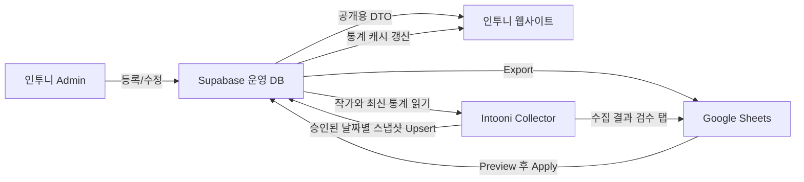
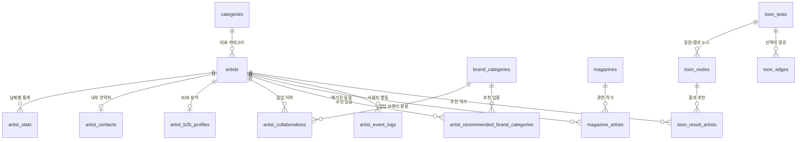

# 인투니 데이터베이스와 Google Sheets 학습 가이드

작성일: 2026-07-11  
대상: 인투니 웹사이트, Supabase 운영 DB, Admin, Collector, Google Sheets

이 문서는 인투니 데이터가 **어디에 저장되고**, **어떤 기능에서 사용되며**, **Google Sheets 및 Collector와 어떻게 이동하는지**를 운영자 관점에서 설명한다.

> 가장 중요한 원칙: **Supabase가 공식 원본(Source of Truth)** 이다. Google Sheets는 관리·검수·조회 화면이고, Collector는 통계를 수집해 승인된 결과만 Supabase에 넣는 별도 프로그램이다.

## 1. 한눈에 보는 전체 구조



### 저장소별 책임

| 위치 | 역할 | 공식 데이터 여부 |
|---|---|---|
| Supabase | 작가, 카테고리, 통계, 매거진, 협업 등 영구 저장 | 공식 원본 |
| Admin | Supabase 데이터를 안전하게 편집하는 운영 UI | 저장소 아님 |
| Google Sheets | 일괄 검수, 명시적 가져오기, 통계 조회 | 보조 관리 화면 |
| Collector | Instagram 팔로워·게시물 수 수집 및 승인 적용 | 수집 도구 |
| 웹사이트 | 공개 가능한 데이터만 사용자에게 표시 | 읽기 화면 |

## 2. 현재 운영 데이터 현황

2026-07-11 운영 Supabase를 직접 조회한 결과다.

| 테이블 | 행 수 | 현재 의미 |
|---|---:|---|
| `categories` | 18 | 공개 작가 카테고리 |
| `artists` | 151 | 등록 작가 |
| `artist_stats` | 300 | 작가별 날짜 통계 스냅샷 |
| `artist_contacts` | 0 | 아직 연락처 입력 전 |
| `brand_categories` | 0 | 아직 브랜드 분류 입력 전 |
| `artist_recommended_brand_categories` | 0 | 아직 추천 관계 입력 전 |
| `artist_b2b_profiles` | 0 | 아직 B2B 분석 입력 전 |
| `artist_collaborations` | 0 | 아직 협업 이력 입력 전 |
| `magazines` | 0 | 현재 운영 DB에는 매거진 없음 |
| `magazine_artists` | 0 | 매거진이 없어 연결도 없음 |
| `artist_event_logs` | 1,685 | 작가/인스타 이동 클릭 로그 |
| `search_query_logs` | 768 | 사이트 검색어 로그 |
| `toon_tests` | 0 | ToonBTI 초안/게시 데이터 없음 |
| `toon_nodes` | 0 | ToonBTI 노드 없음 |
| `toon_edges` | 0 | ToonBTI 경로 없음 |
| `toon_result_artists` | 0 | ToonBTI 결과 작가 연결 없음 |
| `sheet_sync_jobs` | 2 | Sheets 작업 감사 로그 |
| `migration_legacy_backup` | 151 | 이전 구조의 복구용 백업 |

### 작가 상태

- 151명 모두 `active` 상태다.
- 151명 모두 사이트 공개와 성장 통계 공개가 켜져 있다.
- 151명 모두 대표 카테고리가 연결되어 있다.
- 2명은 `hide_from_new=true`라서 신규 작가 영역에서만 제외된다.
- `is_trending=true`인 작가는 현재 없다.

### 작가 데이터 완성도

| 항목 | 입력된 작가 수 | 전체 151명 대비 |
|---|---:|---:|
| 프로필 이미지 | 139 | 92.1% |
| 캐릭터 이미지 | 114 | 75.5% |
| 대표 게시물 갤러리 | 147 | 97.4% |
| 해시태그 | 149 | 98.7% |
| 검색 태그 | 131 | 86.8% |
| 분위기 태그 | 93 | 61.6% |
| 그림체 태그 | 92 | 60.9% |
| 주제 태그 | 90 | 59.6% |
| 소개문 `bio` | 3 | 2.0% |

작가명·인스타 계정 공란은 0건이고, 정규화된 인스타 계정 중복도 0건이다. 현재 가장 큰 콘텐츠 보강 과제는 `bio`와 세부 분석 태그다.

### `artist_stats`가 300행인 이유

`artist_stats`의 한 행은 작가 한 명이 아니라 **작가 한 명의 특정 날짜 기록 한 개**다.

```text
artist_id + recorded_date = 통계 한 행
```

현재 분포:

| 날짜 | 스냅샷 수 | 설명 |
|---|---:|---|
| 2026-04-01 | 149 | 이전 데이터에서 복원한 비교 기준값 |
| 2026-07-05 | 149 | 수집/이관된 통계 |
| 2026-07-06 | 1 | 개별 입력 통계 |
| 2026-07-09 | 1 | 개별 입력 통계 |

- 149명은 스냅샷 2개를 가진다.
- 2명은 스냅샷 1개를 가진다.
- 통계가 하나도 없는 작가는 없다.
- `2026-04-01` 값은 Collector가 그날 직접 수집한 원본이 아니라, 이전 주간 증가값을 이용해 복원한 기준값이다.

## 3. 핵심 관계 ERD

업무 영역별로 선을 줄여서 보려면 [DB 권장 분류 지도](DB_DOMAIN_MAP.md)를 함께 참고한다.



`||--o{`는 왼쪽 한 행에 오른쪽 여러 행이 연결될 수 있다는 뜻이다.

## 4. 테이블별 상세 설명

### 4.1 작가와 카테고리

#### `categories`

작가의 대표 카테고리 목록이다.

| 열 | 의미 |
|---|---|
| `id` | UUID 기본키 |
| `name` | 카테고리명, 중복 불가 |
| `sort_order` | 표시 순서 |
| `created_at`, `updated_at` | 생성·수정 시각 |

이름은 저장 전에 공백 제거와 Unicode NFC 정규화를 거친다.

#### `artists`

모든 작가의 중심 테이블이다. 팔로워 수나 게시물 수는 여기에 넣지 않는다.

| 열 그룹 | 주요 열 | 의미 |
|---|---|---|
| 식별 | `id`, `name`, `instagram_handle` | 작가 고유 ID, 표시명, 인스타 계정 |
| 분류 | `main_category_id` | `categories.id` 참조 |
| 공개 소개 | `bio`, `hashtags` | 사이트에 보여줄 소개와 해시태그 |
| 검색/분석 태그 | `search_tags`, `mood_tags`, `style_tags`, `topic_tags` | 검색 및 작가 특성 분류 |
| 이미지 | `thumbnail_url`, `character_url`, `gallery_post_urls` | 프로필, 누끼, 대표 게시물 |
| 노출 설정 | `show_on_site`, `show_growth_on_site`, `is_trending`, `hide_from_new` | 화면별 노출 제어 |
| 운영 상태 | `status`, `sort_order` | 활성/숨김/보관, 정렬 순서 |
| 내부 정보 | `internal_memo` | 관리자 전용 메모, 공개 금지 |

`instagram_handle`은 `@`를 제거하고 소문자로 정규화하며 중복을 허용하지 않는다.

### 4.2 통계

#### `artist_stats`

팔로워 수와 게시물 수의 공식 날짜별 기록이다.

| 열 | 의미 |
|---|---|
| `id` | 스냅샷 UUID |
| `artist_id` | 대상 작가 |
| `recorded_date` | 수집 기준 날짜 |
| `followers` | 해당 날짜 팔로워 수 |
| `post_count` | 해당 날짜 게시물 수 |
| `created_at`, `updated_at` | DB 생성·수정 시각 |

제약 조건:

- `(artist_id, recorded_date)` 조합은 하나만 존재한다.
- 팔로워와 게시물 수는 0 이상이다.
- 같은 작가·같은 날짜를 다시 적용하면 새 행을 만들지 않고 기존 행을 갱신한다.
- 증가 수와 증가율은 저장하지 않고 두 날짜의 스냅샷을 비교해 계산한다.
- 비교 기간은 4주로 고정하지 않는다. 존재하는 과거 기록과 최신 기록의 실제 간격을 사용한다.

예시:

```text
작가 A / 2026-07-05 / 팔로워 10,000 / 게시물 100
작가 A / 2026-07-12 / 팔로워 10,500 / 게시물 103

팔로워 증가 수 = 500
팔로워 증가율 = 500 / 10,000 * 100 = 5%
게시물 증가 수 = 3
```

### 4.3 내부 운영 정보

#### `artist_contacts`

작가당 최대 한 행을 가지는 연락처다. `email`, `dm_available`을 저장하며 공개 API에 포함하지 않는다.

#### `brand_categories`

광고·협업에 사용하는 브랜드 업종 분류다. 공개 작가 카테고리인 `categories`와 목적이 다르다.

#### `artist_recommended_brand_categories`

작가와 추천 브랜드 업종의 다대다 연결 테이블이다. 한 작가에게 여러 업종을 추천할 수 있다.

#### `artist_b2b_profiles`

작가당 한 행의 내부 협업 분석이다.

- `strengths`: 협업 강점
- `cautions`: 유의사항
- `brand_safety_grade`: `unknown`, `safe`, `normal`, `caution`

#### `artist_collaborations`

작가 한 명에게 협업 이력을 여러 개 추가할 수 있다.

| 열 | 의미 |
|---|---|
| `brand_name` | 브랜드명 |
| `brand_category_id` | 브랜드 업종, 선택 사항 |
| `collaboration_year`, `collaboration_month` | 협업 연월 |
| `post_url` | 관련 게시물 링크 |
| `content_summary` | 캠페인 또는 게시물 내용 |
| `ad_disclosure_status` | 광고 표시 여부: `yes`, `no`, `unknown` |
| `likes`, `comments`, `views` | 선택적 성과 수치 |

같은 작가에게 같은 `post_url`을 중복 저장할 수 없다.

### 4.4 매거진

#### `magazines`

매거진 본문 자체를 저장한다. 제목, 본문, 썸네일, 인스타 링크, 공개 여부, 발행일을 가진다.

#### `magazine_artists`

매거진과 작가를 연결하는 다대다 테이블이다. 이것이 “매거진 글 안에서 관련 작가를 임베드로 소개”하는 기능의 연결 정보다.

```text
magazine_id -> 어떤 매거진인지
artist_id   -> 어떤 작가를 소개하는지
sort_order  -> 매거진 안에서 작가 표시 순서
```

작가 정보를 `magazines` 안에 복사하지 않기 때문에, 작가 이름이나 프로필을 수정하면 매거진의 관련 작가 표시도 최신 작가 정보를 사용한다.

### 4.5 사용자 행동 로그

#### `artist_event_logs`

작가 카드 클릭과 Instagram 이동 같은 행동을 저장한다. 과거 이벤트 이름도 호환을 위해 허용하지만, 통계 화면에서는 `artist_click`과 `instagram_outbound` 두 그룹으로 정규화한다.

#### `search_query_logs`

사용자가 사이트에서 검색한 문자열과 시각을 저장한다. 인기 검색어와 검색 수요 분석에 사용한다.

### 4.6 ToonBTI

| 테이블 | 역할 |
|---|---|
| `toon_tests` | 테스트 기본 정보와 편집기 전체 초안 JSON |
| `toon_nodes` | 질문 노드와 결과 노드 |
| `toon_edges` | 선택지에 따른 노드 이동 경로 |
| `toon_result_artists` | 결과 노드별 추천 작가와 순서 |

노드와 경로는 테스트가 삭제되면 함께 삭제된다. 결과에 연결된 작가가 있으면 작가 원본의 물리 삭제는 제한된다.

### 4.7 운영·복구

#### `sheet_sync_jobs`

Sheets Export, Preview, Apply 작업의 성공·실패·요약을 남기는 감사 로그다. 실제 작가 데이터가 아니라 “누가 어떤 동기화 작업을 했는지”를 기록한다.

#### `migration_legacy_backup`

이전 DB 구조를 정리하기 직전에 JSON으로 보관한 복구 증거다. 현재 웹사이트가 읽는 활성 데이터가 아니며 임의 삭제하면 안 된다.

## 5. 삭제 규칙을 이해하는 법

- `ON DELETE RESTRICT`: 연결 데이터가 있으면 원본 삭제를 막는다. 작가는 보통 삭제하지 않고 `archived`로 보관한다.
- `ON DELETE CASCADE`: 부모가 삭제되면 자식도 함께 삭제한다. 매거진-작가 연결과 ToonBTI 내부 구조에 사용한다.
- `ON DELETE SET NULL`: 분류가 삭제되어도 협업 기록은 남기고 분류 연결만 비운다.

## 6. 보안과 공개 범위

- `artists`, `artist_stats`, 연락처, B2B, 협업, ToonBTI 원본에는 RLS가 켜져 있다.
- 브라우저의 `anon` 키로 내부 테이블을 직접 읽지 못하게 막는다.
- 웹사이트는 서버에서 필요한 열만 골라 공개 DTO로 변환한다.
- `internal_memo`, 연락처, B2B 분석, 협업 내부 내용은 공개 HTML·API·메타데이터·사이트맵에 넣지 않는다.
- `categories`와 공개 상태의 `magazines`만 제한적으로 공개 읽기를 허용한다.
- Admin과 Collector의 DB 쓰기는 `service_role`을 사용하므로 키를 브라우저 코드에 넣으면 안 된다.

## 7. Google Sheets 구조

대상 문서: [intooni_Database](https://docs.google.com/spreadsheets/d/1tFaqt6mlU7bht6qTR5Z_MKbcoKN-Z86LuHrrNCoaTg8/edit)

현재 탭은 15개다.

### 7.1 Admin 관리 탭

| 탭 | 내용 | Sheets에서 DB 반영 |
|---|---|---|
| `categories` | 작가 카테고리 | Preview 후 Apply 가능 |
| `brand_categories` | 브랜드 업종 | Preview 후 Apply 가능 |
| `artists` | 작가 기본 정보 | Preview 후 Apply 가능 |
| `artist_stats` | 날짜별 원시 통계 | 별도 통계 Preview/Apply만 가능 |
| `artist_contacts` | 내부 연락처 | Preview 후 Apply 가능 |
| `artist_collaborations` | 협업 이력 | Preview 후 Apply 가능 |
| `artist_b2b_profiles` | B2B 분석 | Preview 후 Apply 가능 |

중요:

- Sheets 셀을 바꾼 즉시 DB가 자동 변경되지는 않는다.
- Admin에서 **Preview**로 검증한 뒤 **Apply**해야 한다.
- DB에서 수정한 뒤 Sheets에 보이게 하려면 **Export**를 실행해야 한다.
- `source_updated_at`은 충돌 감지를 위한 값이므로 임의 수정하지 않는다.
- UUID 열은 기존 행 수정 시 그대로 유지한다.

### 7.2 사람이 읽기 좋은 통계 탭

| 탭 | 행 | 열 | 수정 용도 |
|---|---|---|---|
| `followers_history` | 작가 | 날짜 | 조회 전용 |
| `posts_history` | 작가 | 날짜 | 조회 전용 |

구조 예시:

```text
artist_id | name | instagram_handle | 2026-07-05 | 2026-07-12
UUID      | 작가A | artist_a         | 10,000     | 10,500
```

이 두 탭은 `artist_stats`를 사람이 보기 쉽게 가로로 펼친 피벗 뷰다. Admin Export를 실행할 때 다시 생성되므로 직접 입력하는 원본으로 사용하지 않는다.

### 7.3 Collector 검수 탭

| 탭 | 역할 |
|---|---|
| `collector_latest` | 이번 실행의 작가별 최신 결과와 승인 여부 |
| `collector_records` | 모든 수집 실행의 누적 기록 |
| `collector_failures` | 수집 실패와 원인 |
| `collector_top5` | 증가 수·증가율 순위 보조 데이터 |
| `collector_apply_log` | DB 적용 결과와 재검증 상태 |
| `collector_ignored_failures` | 운영자가 제외한 실패 기록 |

이 탭들은 검수 화면이다. `collector_latest`에 값이 나타났다는 이유만으로 Supabase가 변경되는 것은 아니다. Collector에서 승인 적용을 실행해야 `artist_stats`에 들어간다.

## 8. Collector와 주간 업데이트 흐름

Collector 경로:

```text
C:\Users\user\Desktop\Projects Files\intooni_Collect
```

권장 주간 운영 순서:

1. `Update New Artists`: Supabase 작가 목록과 최신 공식 통계를 가져온다.
2. `Collect All`: Instagram 팔로워·게시물 수를 수집한다.
3. `collector_latest`, 실패 목록, 증가 수를 검수한다.
4. 잘못된 계정이나 비정상 수치를 수정·재수집한다.
5. 적용할 성공 행만 승인한다.
6. `Apply Approved`: `(artist_id, recorded_date)` 기준으로 `artist_stats`에 반영한다.
7. 웹사이트 통계 캐시를 갱신한다.
8. Admin의 Sheets Export를 실행해 `followers_history`, `posts_history` 날짜 열을 갱신한다.

Collector는 증가율 자체를 공식 원본으로 저장하지 않는다. 공식 원본은 날짜별 팔로워·게시물 수이며, 증가 수와 증가율은 필요할 때 계산한다.

## 9. 어떤 화면에서 무엇을 수정해야 하나

| 하고 싶은 일 | 권장 위치 |
|---|---|
| 작가 한 명 정보 수정 | Admin 작가 관리 |
| 카테고리 여러 개 일괄 수정 | Sheets 수정 -> Admin Preview -> Apply |
| 주간 팔로워·게시물 수집 | Collector |
| 과거 통계 수동 보정 | `artist_stats` 탭 -> 전용 Preview -> Apply |
| 팔로워 추이 확인 | `followers_history` |
| 게시물 추이 확인 | `posts_history` |
| 작가 협업 추가 | Admin 협업 이력 또는 `artist_collaborations` 탭 |
| 매거진 관련 작가 연결 | Admin 매거진 편집, 내부적으로 `magazine_artists` 사용 |

## 10. DB 정돈 내용

`202607110009_schema_housekeeping.sql`은 데이터 행을 변경하지 않는 정돈 마이그레이션이다.

추가하는 항목:

- 전체 날짜 기준 통계 조회 인덱스
- 작가별 협업 연혁 조회 인덱스
- 브랜드 업종별 추천 작가 조회 인덱스
- Sheets 작업 상태별 감사 로그 조회 인덱스
- ToonBTI 게시 상태와 결과 작가 조회 인덱스
- 핵심 테이블의 용도를 설명하는 DB 주석

이 마이그레이션에는 `INSERT`, `UPDATE`, `DELETE`, `DROP`, `TRUNCATE`가 없다.

## 11. 자주 쓰는 읽기 전용 SQL

### 작가별 통계 이력

```sql
select
  a.name,
  a.instagram_handle,
  s.recorded_date,
  s.followers,
  s.post_count
from public.artist_stats s
join public.artists a on a.id = s.artist_id
order by a.name, s.recorded_date;
```

### 작가별 최신 통계

```sql
select distinct on (s.artist_id)
  a.name,
  a.instagram_handle,
  s.recorded_date,
  s.followers,
  s.post_count
from public.artist_stats s
join public.artists a on a.id = s.artist_id
order by s.artist_id, s.recorded_date desc;
```

### 통계가 한 번뿐인 작가

```sql
select a.name, a.instagram_handle, count(s.id) as snapshot_count
from public.artists a
left join public.artist_stats s on s.artist_id = a.id
group by a.id, a.name, a.instagram_handle
having count(s.id) < 2
order by a.name;
```

### 매거진과 관련 작가

```sql
select
  m.title,
  a.name as artist_name,
  ma.sort_order
from public.magazine_artists ma
join public.magazines m on m.id = ma.magazine_id
join public.artists a on a.id = ma.artist_id
order by m.published_at desc, ma.sort_order;
```

## 12. 현재 주의할 점

1. 협업·연락처·B2B·매거진·ToonBTI 테이블은 구조만 있고 운영 데이터는 아직 없다.
2. `2026-04-01` 통계는 복원 기준값이므로 Collector 직접 수집값과 구분해서 해석해야 한다.
3. Sheets는 실시간 양방향 동기화가 아니다. Export와 Preview/Apply라는 명시적 단계가 있다.
4. `migration_legacy_backup`은 화면용 데이터가 아니지만 복구를 위해 유지한다.
5. 운영 DB의 물리 삭제보다 `artists.status='archived'`를 우선한다.
6. 새 마이그레이션은 운영 적용 전에 백업과 읽기 전용 검증 SQL을 먼저 실행한다.

## 13. 관련 파일

| 파일 | 역할 |
|---|---|
| `supabase/schema.sql` | 새 환경에서 참고하는 최종 목표 스키마 |
| `supabase/migrations/` | 운영 DB를 순서대로 변경한 이력 |
| `supabase/sql-editor/20260711_post_migration_verify.sql` | 적용 후 읽기 전용 검증 |
| `lib/database.types.ts` | 애플리케이션의 DB TypeScript 타입 |
| `lib/server/admin-sheets.ts` | Admin-Sheets Export/Preview/Apply |
| `lib/server/google-sheets.ts` | Google Sheets API 연결 |
| `docs/COLLECTOR_INTEGRATION.md` | Collector 상세 연결 문서 |

이 문서의 행 수는 2026-07-11 시점 스냅샷이다. 구조 설명은 마이그레이션이 추가될 때 함께 갱신해야 한다.
